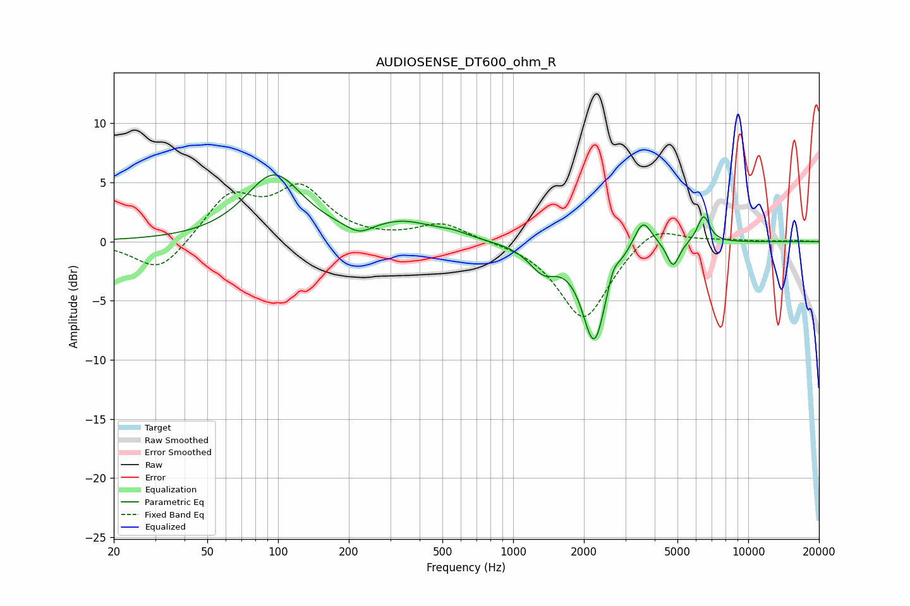

# AUDIOSENSE_DT600_ohm_R
See [usage instructions](https://github.com/jaakkopasanen/AutoEq#usage) for more options and info.

### Parametric EQs
Apply preamp of -5.7 dB when using parametric equalizer.

|   # | Type    |   Fc (Hz) |    Q |   Gain (dB) |
|-----|---------|-----------|------|-------------|
|   1 | Peaking |        96 | 1.17 |         5.6 |
|   2 | Peaking |       221 | 2.63 |        -0.9 |
|   3 | Peaking |       341 | 1.07 |         1.5 |
|   4 | Peaking |       555 | 2.07 |         0.4 |
|   5 | Peaking |      1342 | 2.36 |        -2   |
|   6 | Peaking |      2212 | 2.75 |        -8.3 |
|   7 | Peaking |      2658 | 6    |         1.2 |
|   8 | Peaking |      3561 | 3.65 |         2.5 |
|   9 | Peaking |      4791 | 5.4  |        -2.1 |
|  10 | Peaking |      6459 | 5.23 |         2.3 |

### Fixed Band EQs
When using fixed band (also called graphic) equalizer, apply preamp of **-5.0 dB** (if available) and set gains manually with these parameters.

|   # | Type    |   Fc (Hz) |    Q |   Gain (dB) |
|-----|---------|-----------|------|-------------|
|   1 | Peaking |        31 | 1.41 |        -2.8 |
|   2 | Peaking |        62 | 1.41 |         3.8 |
|   3 | Peaking |       125 | 1.41 |         4.2 |
|   4 | Peaking |       250 | 1.41 |         0   |
|   5 | Peaking |       500 | 1.41 |         1.5 |
|   6 | Peaking |      1000 | 1.41 |         0   |
|   7 | Peaking |      2000 | 1.41 |        -6.7 |
|   8 | Peaking |      4000 | 1.41 |         1.7 |
|   9 | Peaking |      8000 | 1.41 |         0.1 |
|  10 | Peaking |     16000 | 1.41 |         0.1 |

### Graphs

