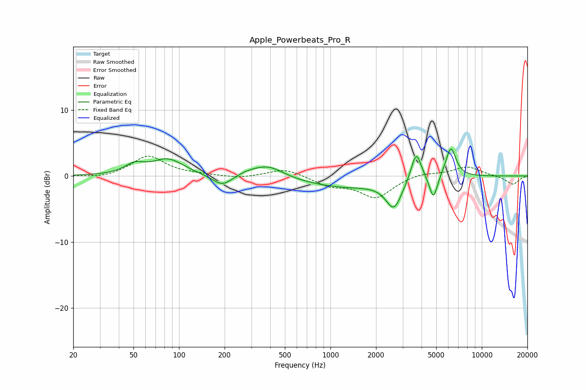

# Apple_Powerbeats_Pro_R
See [usage instructions](https://github.com/jaakkopasanen/AutoEq#usage) for more options and info.

### Parametric EQs
Apply preamp of -4.2 dB when using parametric equalizer.

|   # | Type    |   Fc (Hz) |    Q |   Gain (dB) |
|-----|---------|-----------|------|-------------|
|   1 | Peaking |        51 | 2.18 |         1.4 |
|   2 | Peaking |        85 | 1.37 |         2.4 |
|   3 | Peaking |       194 | 2.06 |        -1.9 |
|   4 | Peaking |       288 | 1.44 |         0.7 |
|   5 | Peaking |       395 | 1.47 |         1.6 |
|   6 | Peaking |      1244 | 0.51 |        -1.7 |
|   7 | Peaking |      2622 | 2.71 |        -4.2 |
|   8 | Peaking |      3684 | 4.14 |         4.6 |
|   9 | Peaking |      4791 | 5.38 |        -3.7 |
|  10 | Peaking |      6242 | 4.05 |         4.6 |

### Fixed Band EQs
When using fixed band (also called graphic) equalizer, apply preamp of **-3.1 dB** (if available) and set gains manually with these parameters.

|   # | Type    |   Fc (Hz) |    Q |   Gain (dB) |
|-----|---------|-----------|------|-------------|
|   1 | Peaking |        31 | 1.41 |        -0.4 |
|   2 | Peaking |        62 | 1.41 |         3   |
|   3 | Peaking |       125 | 1.41 |         0.2 |
|   4 | Peaking |       250 | 1.41 |        -0.4 |
|   5 | Peaking |       500 | 1.41 |         1.2 |
|   6 | Peaking |      1000 | 1.41 |        -1.4 |
|   7 | Peaking |      2000 | 1.41 |        -3.2 |
|   8 | Peaking |      4000 | 1.41 |         0.5 |
|   9 | Peaking |      8000 | 1.41 |         1.4 |
|  10 | Peaking |     16000 | 1.41 |        -1.3 |

### Graphs

