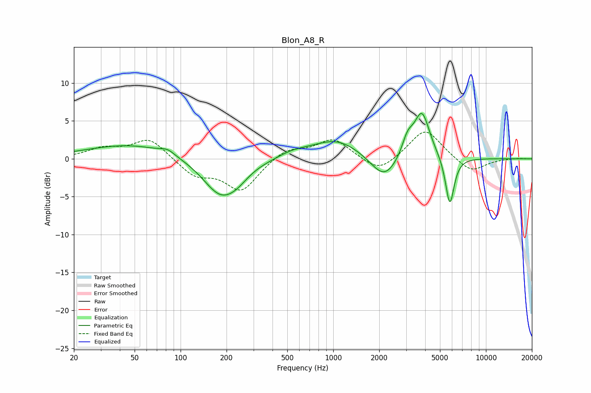

# Blon_A8_R
See [usage instructions](https://github.com/jaakkopasanen/AutoEq#usage) for more options and info.

### Parametric EQs
Apply preamp of -6.1 dB when using parametric equalizer.

|   # | Type    |   Fc (Hz) |    Q |   Gain (dB) |
|-----|---------|-----------|------|-------------|
|   1 | Peaking |        48 | 0.48 |         1.9 |
|   2 | Peaking |        82 | 3.12 |         0.6 |
|   3 | Peaking |       184 | 1.18 |        -5   |
|   4 | Peaking |       236 | 2.04 |        -0.8 |
|   5 | Peaking |       547 | 1.4  |         0.7 |
|   6 | Peaking |      1052 | 0.88 |         2.6 |
|   7 | Peaking |      2163 | 1.58 |        -3.3 |
|   8 | Peaking |      3068 | 3.78 |         2.4 |
|   9 | Peaking |      3807 | 2.71 |         6.1 |
|  10 | Peaking |      5799 | 4.84 |        -6.5 |

### Fixed Band EQs
When using fixed band (also called graphic) equalizer, apply preamp of **-3.6 dB** (if available) and set gains manually with these parameters.

|   # | Type    |   Fc (Hz) |    Q |   Gain (dB) |
|-----|---------|-----------|------|-------------|
|   1 | Peaking |        31 | 1.41 |         1.2 |
|   2 | Peaking |        62 | 1.41 |         2.7 |
|   3 | Peaking |       125 | 1.41 |        -2.2 |
|   4 | Peaking |       250 | 1.41 |        -4.2 |
|   5 | Peaking |       500 | 1.41 |         1.4 |
|   6 | Peaking |      1000 | 1.41 |         2.6 |
|   7 | Peaking |      2000 | 1.41 |        -2   |
|   8 | Peaking |      4000 | 1.41 |         4   |
|   9 | Peaking |      8000 | 1.41 |        -1.9 |
|  10 | Peaking |     16000 | 1.41 |         0.1 |

### Graphs

