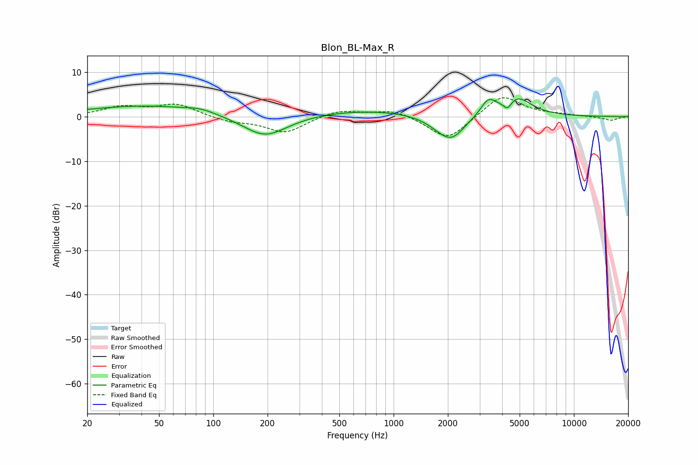

# Blon_BL-Max_R
See [usage instructions](https://github.com/jaakkopasanen/AutoEq#usage) for more options and info.

### Parametric EQs
Apply preamp of -4.1 dB when using parametric equalizer.

|   # | Type    |   Fc (Hz) |    Q |   Gain (dB) |
|-----|---------|-----------|------|-------------|
|   1 | Peaking |        42 | 0.42 |         2.4 |
|   2 | Peaking |        85 | 1.82 |         0.8 |
|   3 | Peaking |       193 | 1.18 |        -0.9 |
|   4 | Peaking |       193 | 1.13 |        -4.1 |
|   5 | Peaking |       696 | 0.47 |         1.5 |
|   6 | Peaking |      1786 | 1.83 |        -1.3 |
|   7 | Peaking |      2103 | 1.92 |        -4.8 |
|   8 | Peaking |      3349 | 3.35 |         3.4 |
|   9 | Peaking |      4288 | 5.99 |        -2.1 |
|  10 | Peaking |      4797 | 1.72 |         4.4 |

### Fixed Band EQs
When using fixed band (also called graphic) equalizer, apply preamp of **-4.3 dB** (if available) and set gains manually with these parameters.

|   # | Type    |   Fc (Hz) |    Q |   Gain (dB) |
|-----|---------|-----------|------|-------------|
|   1 | Peaking |        31 | 1.41 |         2   |
|   2 | Peaking |        62 | 1.41 |         2.7 |
|   3 | Peaking |       125 | 1.41 |        -1.1 |
|   4 | Peaking |       250 | 1.41 |        -3.6 |
|   5 | Peaking |       500 | 1.41 |         1.6 |
|   6 | Peaking |      1000 | 1.41 |         1.6 |
|   7 | Peaking |      2000 | 1.41 |        -5.4 |
|   8 | Peaking |      4000 | 1.41 |         5.1 |
|   9 | Peaking |      8000 | 1.41 |         0.3 |
|  10 | Peaking |     16000 | 1.41 |        -0.9 |

### Graphs

