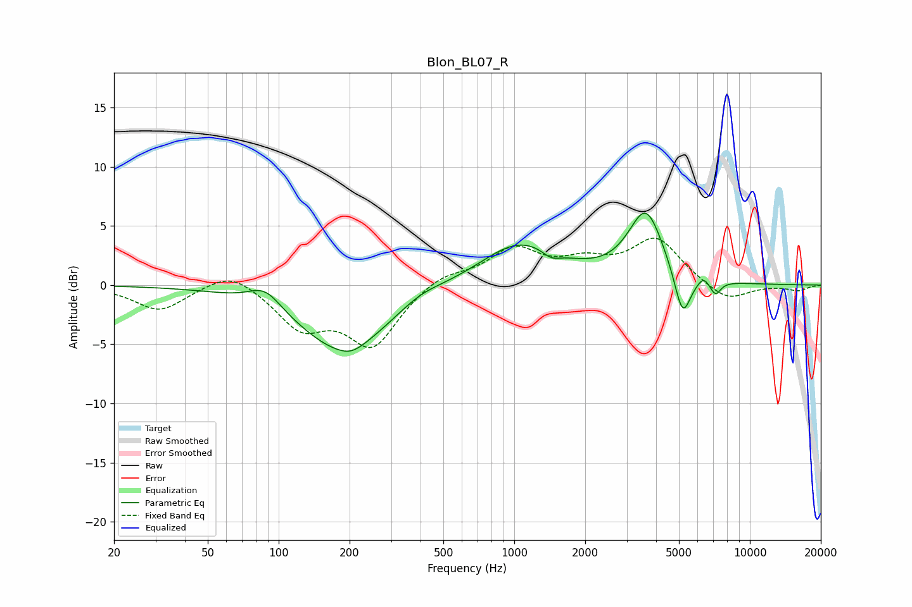

# Blon_BL07_R
See [usage instructions](https://github.com/jaakkopasanen/AutoEq#usage) for more options and info.

### Parametric EQs
Apply preamp of -6.2 dB when using parametric equalizer.

|   # | Type    |   Fc (Hz) |    Q |   Gain (dB) |
|-----|---------|-----------|------|-------------|
|   1 | Peaking |        88 | 2.04 |         1.7 |
|   2 | Peaking |       190 | 0.71 |        -5.6 |
|   3 | Peaking |       204 | 2.83 |        -0.4 |
|   4 | Peaking |       400 | 1.48 |         0.7 |
|   5 | Peaking |      1054 | 0.83 |         3.6 |
|   6 | Peaking |      1435 | 3.67 |        -0.7 |
|   7 | Peaking |      3619 | 1.89 |         6   |
|   8 | Peaking |      5183 | 3.98 |        -4   |
|   9 | Peaking |      6349 | 6    |         0.6 |
|  10 | Peaking |      7141 | 5.96 |        -1.2 |

### Fixed Band EQs
When using fixed band (also called graphic) equalizer, apply preamp of **-4.1 dB** (if available) and set gains manually with these parameters.

|   # | Type    |   Fc (Hz) |    Q |   Gain (dB) |
|-----|---------|-----------|------|-------------|
|   1 | Peaking |        31 | 1.41 |        -2.1 |
|   2 | Peaking |        62 | 1.41 |         1.5 |
|   3 | Peaking |       125 | 1.41 |        -3.3 |
|   4 | Peaking |       250 | 1.41 |        -5   |
|   5 | Peaking |       500 | 1.41 |         1   |
|   6 | Peaking |      1000 | 1.41 |         2.9 |
|   7 | Peaking |      2000 | 1.41 |         1.6 |
|   8 | Peaking |      4000 | 1.41 |         3.8 |
|   9 | Peaking |      8000 | 1.41 |        -1.5 |
|  10 | Peaking |     16000 | 1.41 |        -0.5 |

### Graphs

