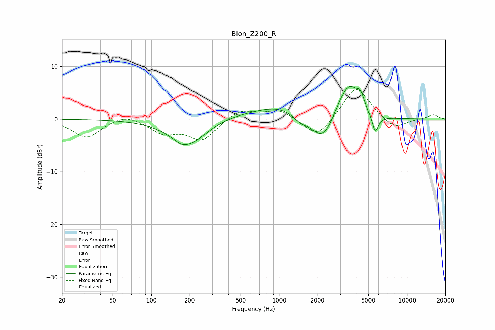

# Blon_Z200_R
See [usage instructions](https://github.com/jaakkopasanen/AutoEq#usage) for more options and info.

### Parametric EQs
Apply preamp of -6.3 dB when using parametric equalizer.

|   # | Type    |   Fc (Hz) |    Q |   Gain (dB) |
|-----|---------|-----------|------|-------------|
|   1 | Peaking |       173 | 3.19 |        -0.5 |
|   2 | Peaking |       196 | 0.96 |        -5   |
|   3 | Peaking |       430 | 0.61 |         1   |
|   4 | Peaking |       971 | 0.87 |         2.1 |
|   5 | Peaking |      1474 | 2.92 |        -1.1 |
|   6 | Peaking |      2170 | 1.7  |        -4.5 |
|   7 | Peaking |      2973 | 3.42 |         1.3 |
|   8 | Peaking |      3543 | 2.1  |         6.1 |
|   9 | Peaking |      4332 | 4.29 |         2.7 |
|  10 | Peaking |      5651 | 5.26 |        -3.5 |

### Fixed Band EQs
When using fixed band (also called graphic) equalizer, apply preamp of **-5.7 dB** (if available) and set gains manually with these parameters.

|   # | Type    |   Fc (Hz) |    Q |   Gain (dB) |
|-----|---------|-----------|------|-------------|
|   1 | Peaking |        31 | 1.41 |        -3.5 |
|   2 | Peaking |        62 | 1.41 |         1.2 |
|   3 | Peaking |       125 | 1.41 |        -2.5 |
|   4 | Peaking |       250 | 1.41 |        -3.9 |
|   5 | Peaking |       500 | 1.41 |         1.9 |
|   6 | Peaking |      1000 | 1.41 |         1.8 |
|   7 | Peaking |      2000 | 1.41 |        -3.8 |
|   8 | Peaking |      4000 | 1.41 |         6.5 |
|   9 | Peaking |      8000 | 1.41 |        -2.1 |
|  10 | Peaking |     16000 | 1.41 |         0.8 |

### Graphs

