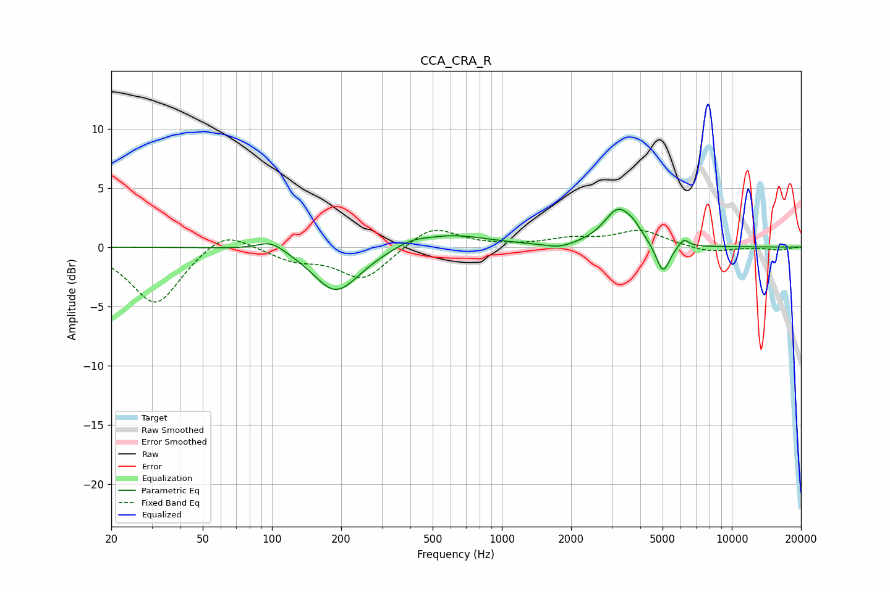

# CCA_CRA_R
See [usage instructions](https://github.com/jaakkopasanen/AutoEq#usage) for more options and info.

### Parametric EQs
Apply preamp of -3.3 dB when using parametric equalizer.

|   # | Type    |   Fc (Hz) |    Q |   Gain (dB) |
|-----|---------|-----------|------|-------------|
|   1 | Peaking |        99 | 2.29 |         0.9 |
|   2 | Peaking |       188 | 1.5  |        -3.4 |
|   3 | Peaking |       232 | 1.31 |        -0.5 |
|   4 | Peaking |       398 | 2.27 |         0.4 |
|   5 | Peaking |       591 | 0.85 |         1.1 |
|   6 | Peaking |      1775 | 2.38 |        -0.4 |
|   7 | Peaking |      3217 | 2.23 |         3.2 |
|   8 | Peaking |      3765 | 4.72 |         0.5 |
|   9 | Peaking |      5018 | 4.68 |        -2.6 |
|  10 | Peaking |      6180 | 6    |         0.7 |

### Fixed Band EQs
When using fixed band (also called graphic) equalizer, apply preamp of **-1.5 dB** (if available) and set gains manually with these parameters.

|   # | Type    |   Fc (Hz) |    Q |   Gain (dB) |
|-----|---------|-----------|------|-------------|
|   1 | Peaking |        31 | 1.41 |        -4.9 |
|   2 | Peaking |        62 | 1.41 |         1.7 |
|   3 | Peaking |       125 | 1.41 |        -1   |
|   4 | Peaking |       250 | 1.41 |        -2.7 |
|   5 | Peaking |       500 | 1.41 |         1.9 |
|   6 | Peaking |      1000 | 1.41 |         0   |
|   7 | Peaking |      2000 | 1.41 |         0.6 |
|   8 | Peaking |      4000 | 1.41 |         1.4 |
|   9 | Peaking |      8000 | 1.41 |        -0.5 |
|  10 | Peaking |     16000 | 1.41 |        -0.2 |

### Graphs

