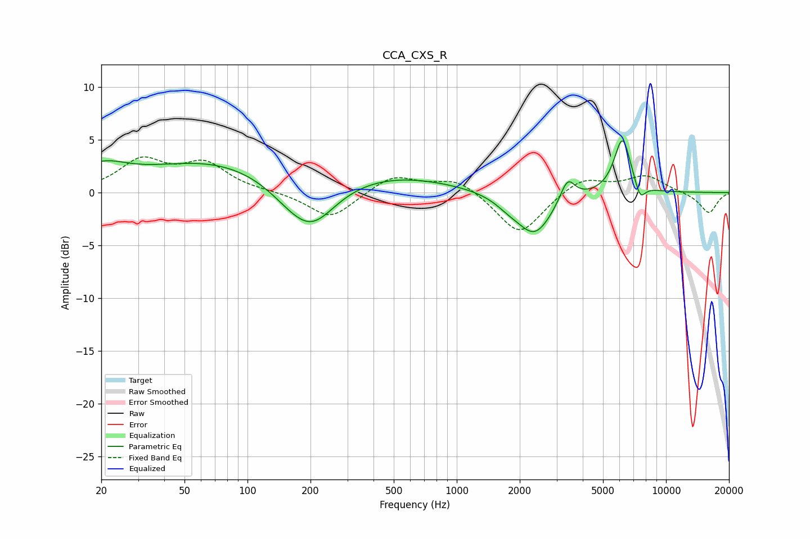

# CCA_CXS_R
See [usage instructions](https://github.com/jaakkopasanen/AutoEq#usage) for more options and info.

### Parametric EQs
Apply preamp of -5.0 dB when using parametric equalizer.

|   # | Type    |   Fc (Hz) |    Q |   Gain (dB) |
|-----|---------|-----------|------|-------------|
|   1 | Peaking |        20 | 1.17 |         2   |
|   2 | Peaking |        69 | 0.43 |         2.9 |
|   3 | Peaking |       164 | 1.12 |        -1.5 |
|   4 | Peaking |       204 | 1.24 |        -3.6 |
|   5 | Peaking |       495 | 0.49 |         1.6 |
|   6 | Peaking |      1760 | 2.16 |        -0.7 |
|   7 | Peaking |      2358 | 1.66 |        -4   |
|   8 | Peaking |      3383 | 4    |         2.2 |
|   9 | Peaking |      6195 | 3.43 |         5.3 |
|  10 | Peaking |      7519 | 5.31 |        -1.6 |

### Fixed Band EQs
When using fixed band (also called graphic) equalizer, apply preamp of **-3.5 dB** (if available) and set gains manually with these parameters.

|   # | Type    |   Fc (Hz) |    Q |   Gain (dB) |
|-----|---------|-----------|------|-------------|
|   1 | Peaking |        31 | 1.41 |         2.9 |
|   2 | Peaking |        62 | 1.41 |         2.6 |
|   3 | Peaking |       125 | 1.41 |         0.1 |
|   4 | Peaking |       250 | 1.41 |        -2.5 |
|   5 | Peaking |       500 | 1.41 |         1.7 |
|   6 | Peaking |      1000 | 1.41 |         1.4 |
|   7 | Peaking |      2000 | 1.41 |        -4.1 |
|   8 | Peaking |      4000 | 1.41 |         1.5 |
|   9 | Peaking |      8000 | 1.41 |         1.6 |
|  10 | Peaking |     16000 | 1.41 |        -2   |

### Graphs

