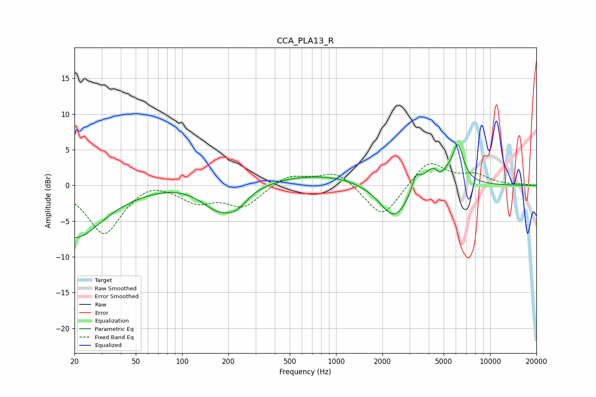

# CCA_PLA13_R
See [usage instructions](https://github.com/jaakkopasanen/AutoEq#usage) for more options and info.

### Parametric EQs
Apply preamp of -5.8 dB when using parametric equalizer.

|   # | Type    |   Fc (Hz) |    Q |   Gain (dB) |
|-----|---------|-----------|------|-------------|
|   1 | Peaking |        20 | 0.78 |        -7.3 |
|   2 | Peaking |        90 | 1.03 |         0.4 |
|   3 | Peaking |       175 | 1.24 |        -3.3 |
|   4 | Peaking |       228 | 2.08 |        -1.6 |
|   5 | Peaking |       789 | 0.42 |         1.6 |
|   6 | Peaking |      2398 | 1.44 |        -5.4 |
|   7 | Peaking |      3295 | 5.57 |         2.1 |
|   8 | Peaking |      4369 | 1.78 |         3.4 |
|   9 | Peaking |      4731 | 4.91 |        -1.4 |
|  10 | Peaking |      6189 | 3.9  |         5   |

### Fixed Band EQs
When using fixed band (also called graphic) equalizer, apply preamp of **-3.1 dB** (if available) and set gains manually with these parameters.

|   # | Type    |   Fc (Hz) |    Q |   Gain (dB) |
|-----|---------|-----------|------|-------------|
|   1 | Peaking |        31 | 1.41 |        -6.8 |
|   2 | Peaking |        62 | 1.41 |         1   |
|   3 | Peaking |       125 | 1.41 |        -2.1 |
|   4 | Peaking |       250 | 1.41 |        -2.9 |
|   5 | Peaking |       500 | 1.41 |         1.6 |
|   6 | Peaking |      1000 | 1.41 |         2.1 |
|   7 | Peaking |      2000 | 1.41 |        -4.7 |
|   8 | Peaking |      4000 | 1.41 |         3.6 |
|   9 | Peaking |      8000 | 1.41 |         1.3 |
|  10 | Peaking |     16000 | 1.41 |         0.1 |

### Graphs

