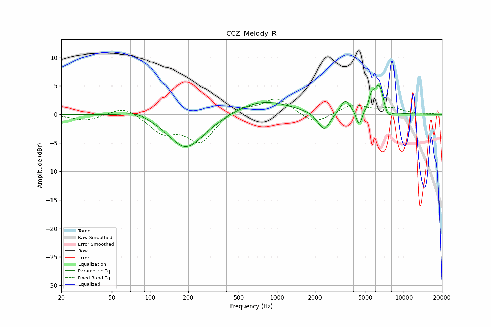

# CCZ_Melody_R
See [usage instructions](https://github.com/jaakkopasanen/AutoEq#usage) for more options and info.

### Parametric EQs
Apply preamp of -5.2 dB when using parametric equalizer.

|   # | Type    |   Fc (Hz) |    Q |   Gain (dB) |
|-----|---------|-----------|------|-------------|
|   1 | Peaking |        79 | 1.41 |         1   |
|   2 | Peaking |       190 | 1.05 |        -5.7 |
|   3 | Peaking |       267 | 1.03 |        -0.6 |
|   4 | Peaking |       779 | 0.66 |         2.5 |
|   5 | Peaking |      2357 | 2.99 |        -3.3 |
|   6 | Peaking |      3467 | 3.58 |         2.6 |
|   7 | Peaking |      4459 | 6    |        -2.7 |
|   8 | Peaking |      5600 | 5.99 |         2.4 |
|   9 | Peaking |      6396 | 3.95 |         4.8 |
|  10 | Peaking |      7519 | 4.95 |        -1.5 |

### Fixed Band EQs
When using fixed band (also called graphic) equalizer, apply preamp of **-2.8 dB** (if available) and set gains manually with these parameters.

|   # | Type    |   Fc (Hz) |    Q |   Gain (dB) |
|-----|---------|-----------|------|-------------|
|   1 | Peaking |        31 | 1.41 |        -1.1 |
|   2 | Peaking |        62 | 1.41 |         1.6 |
|   3 | Peaking |       125 | 1.41 |        -3   |
|   4 | Peaking |       250 | 1.41 |        -4.8 |
|   5 | Peaking |       500 | 1.41 |         1.5 |
|   6 | Peaking |      1000 | 1.41 |         2.9 |
|   7 | Peaking |      2000 | 1.41 |        -1.8 |
|   8 | Peaking |      4000 | 1.41 |         1.7 |
|   9 | Peaking |      8000 | 1.41 |         1   |
|  10 | Peaking |     16000 | 1.41 |         0.1 |

### Graphs

