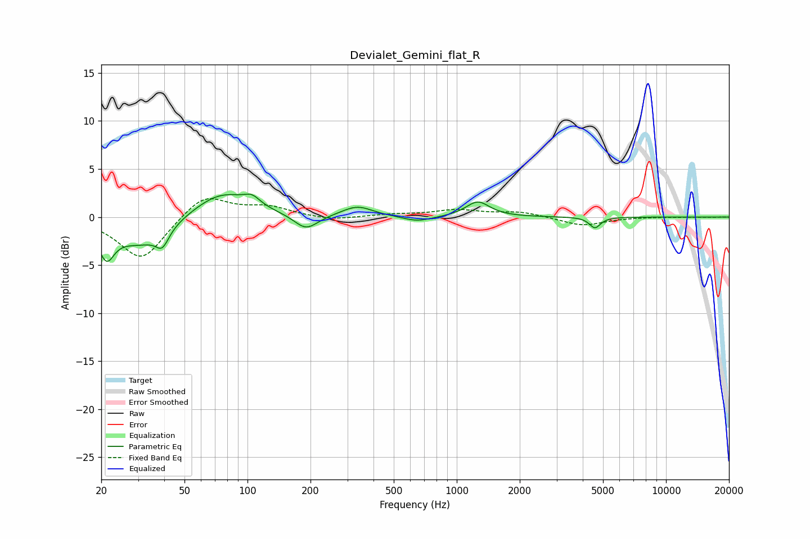

# Devialet_Gemini_flat_R
See [usage instructions](https://github.com/jaakkopasanen/AutoEq#usage) for more options and info.

### Parametric EQs
Apply preamp of -2.5 dB when using parametric equalizer.

|   # | Type    |   Fc (Hz) |    Q |   Gain (dB) |
|-----|---------|-----------|------|-------------|
|   1 | Peaking |        21 | 3.93 |        -3.1 |
|   2 | Peaking |        31 | 1.07 |        -2.8 |
|   3 | Peaking |        39 | 4.62 |        -1.7 |
|   4 | Peaking |        75 | 1.03 |         2.7 |
|   5 | Peaking |       105 | 3.78 |         0.9 |
|   6 | Peaking |       190 | 2.46 |        -1.6 |
|   7 | Peaking |       335 | 1.94 |         1.1 |
|   8 | Peaking |       649 | 2.03 |        -0.6 |
|   9 | Peaking |      1261 | 2.51 |         1.6 |
|  10 | Peaking |      4575 | 5.38 |        -1.1 |

### Fixed Band EQs
When using fixed band (also called graphic) equalizer, apply preamp of **-2.0 dB** (if available) and set gains manually with these parameters.

|   # | Type    |   Fc (Hz) |    Q |   Gain (dB) |
|-----|---------|-----------|------|-------------|
|   1 | Peaking |        31 | 1.41 |        -4.5 |
|   2 | Peaking |        62 | 1.41 |         2.5 |
|   3 | Peaking |       125 | 1.41 |         1   |
|   4 | Peaking |       250 | 1.41 |        -0.4 |
|   5 | Peaking |       500 | 1.41 |         0.2 |
|   6 | Peaking |      1000 | 1.41 |         0.7 |
|   7 | Peaking |      2000 | 1.41 |         0.5 |
|   8 | Peaking |      4000 | 1.41 |        -0.9 |
|   9 | Peaking |      8000 | 1.41 |         0   |
|  10 | Peaking |     16000 | 1.41 |        -0   |

### Graphs

