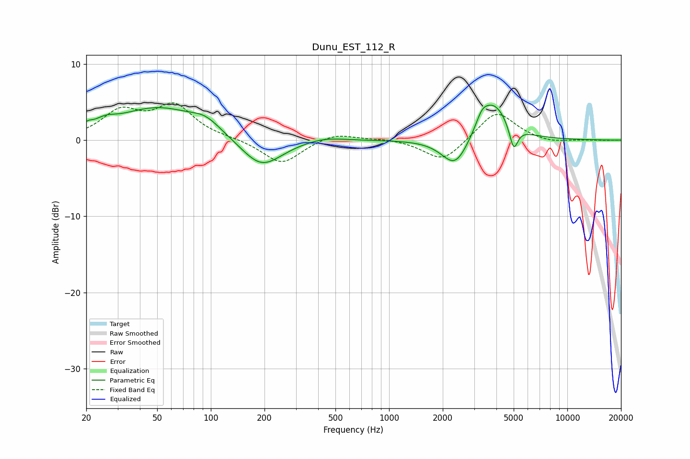

# Dunu_EST_112_R
See [usage instructions](https://github.com/jaakkopasanen/AutoEq#usage) for more options and info.

### Parametric EQs
Apply preamp of -4.7 dB when using parametric equalizer.

|   # | Type    |   Fc (Hz) |    Q |   Gain (dB) |
|-----|---------|-----------|------|-------------|
|   1 | Peaking |        20 | 5.71 |         0.5 |
|   2 | Peaking |        25 | 2.48 |         0.9 |
|   3 | Peaking |        50 | 0.61 |         4.2 |
|   4 | Peaking |        94 | 1.73 |         1.4 |
|   5 | Peaking |       192 | 1.23 |        -3.9 |
|   6 | Peaking |       434 | 1.3  |         0.6 |
|   7 | Peaking |      2353 | 1.89 |        -4   |
|   8 | Peaking |      3317 | 4.31 |         1.4 |
|   9 | Peaking |      3837 | 1.64 |         5.1 |
|  10 | Peaking |      4999 | 5.91 |        -3.3 |

### Fixed Band EQs
When using fixed band (also called graphic) equalizer, apply preamp of **-5.0 dB** (if available) and set gains manually with these parameters.

|   # | Type    |   Fc (Hz) |    Q |   Gain (dB) |
|-----|---------|-----------|------|-------------|
|   1 | Peaking |        31 | 1.41 |         3.5 |
|   2 | Peaking |        62 | 1.41 |         4.3 |
|   3 | Peaking |       125 | 1.41 |         0.2 |
|   4 | Peaking |       250 | 1.41 |        -3.2 |
|   5 | Peaking |       500 | 1.41 |         1   |
|   6 | Peaking |      1000 | 1.41 |         0.2 |
|   7 | Peaking |      2000 | 1.41 |        -2.9 |
|   8 | Peaking |      4000 | 1.41 |         3.9 |
|   9 | Peaking |      8000 | 1.41 |        -0.4 |
|  10 | Peaking |     16000 | 1.41 |        -0   |

### Graphs

