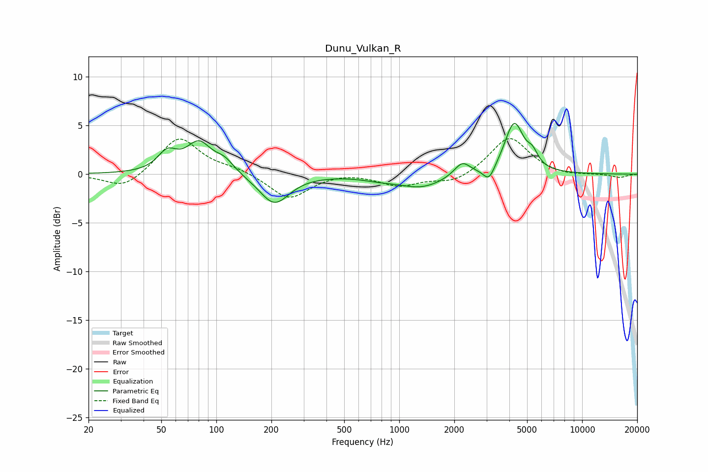

# Dunu_Vulkan_R
See [usage instructions](https://github.com/jaakkopasanen/AutoEq#usage) for more options and info.

### Parametric EQs
Apply preamp of -5.3 dB when using parametric equalizer.

|   # | Type    |   Fc (Hz) |    Q |   Gain (dB) |
|-----|---------|-----------|------|-------------|
|   1 | Peaking |        54 | 2.7  |         1.9 |
|   2 | Peaking |        80 | 2.07 |         3   |
|   3 | Peaking |       111 | 2.7  |         1.1 |
|   4 | Peaking |       208 | 1.73 |        -3.1 |
|   5 | Peaking |       779 | 1.43 |        -0.3 |
|   6 | Peaking |      1326 | 1.13 |        -1.3 |
|   7 | Peaking |      2208 | 3.23 |         1.4 |
|   8 | Peaking |      3097 | 4.5  |        -1.5 |
|   9 | Peaking |      4250 | 2.69 |         5.2 |
|  10 | Peaking |      5360 | 4.75 |         1.2 |

### Fixed Band EQs
When using fixed band (also called graphic) equalizer, apply preamp of **-3.8 dB** (if available) and set gains manually with these parameters.

|   # | Type    |   Fc (Hz) |    Q |   Gain (dB) |
|-----|---------|-----------|------|-------------|
|   1 | Peaking |        31 | 1.41 |        -1.6 |
|   2 | Peaking |        62 | 1.41 |         3.9 |
|   3 | Peaking |       125 | 1.41 |         0.5 |
|   4 | Peaking |       250 | 1.41 |        -2.6 |
|   5 | Peaking |       500 | 1.41 |         0.3 |
|   6 | Peaking |      1000 | 1.41 |        -1.2 |
|   7 | Peaking |      2000 | 1.41 |        -0.9 |
|   8 | Peaking |      4000 | 1.41 |         3.9 |
|   9 | Peaking |      8000 | 1.41 |        -0.2 |
|  10 | Peaking |     16000 | 1.41 |        -0.4 |

### Graphs

