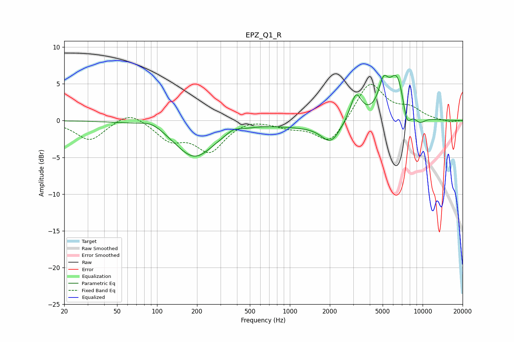

# EPZ_Q1_R
See [usage instructions](https://github.com/jaakkopasanen/AutoEq#usage) for more options and info.

### Parametric EQs
Apply preamp of -6.3 dB when using parametric equalizer.

|   # | Type    |   Fc (Hz) |    Q |   Gain (dB) |
|-----|---------|-----------|------|-------------|
|   1 | Peaking |        91 | 1.67 |         0.9 |
|   2 | Peaking |       191 | 0.95 |        -4.9 |
|   3 | Peaking |       375 | 3.06 |         0.5 |
|   4 | Peaking |      1175 | 0.76 |        -0.6 |
|   5 | Peaking |      2036 | 1.95 |        -2.8 |
|   6 | Peaking |      3145 | 3.32 |         3.7 |
|   7 | Peaking |      5064 | 3.86 |         3.5 |
|   8 | Peaking |      6438 | 2.15 |         6.3 |
|   9 | Peaking |      7593 | 4.15 |        -3.3 |
|  10 | Peaking |      9506 | 3.1  |        -1   |

### Fixed Band EQs
When using fixed band (also called graphic) equalizer, apply preamp of **-5.0 dB** (if available) and set gains manually with these parameters.

|   # | Type    |   Fc (Hz) |    Q |   Gain (dB) |
|-----|---------|-----------|------|-------------|
|   1 | Peaking |        31 | 1.41 |        -2.7 |
|   2 | Peaking |        62 | 1.41 |         1.5 |
|   3 | Peaking |       125 | 1.41 |        -2.4 |
|   4 | Peaking |       250 | 1.41 |        -4   |
|   5 | Peaking |       500 | 1.41 |         0.5 |
|   6 | Peaking |      1000 | 1.41 |        -0.8 |
|   7 | Peaking |      2000 | 1.41 |        -3.3 |
|   8 | Peaking |      4000 | 1.41 |         5.3 |
|   9 | Peaking |      8000 | 1.41 |         1.4 |
|  10 | Peaking |     16000 | 1.41 |        -0.3 |

### Graphs

