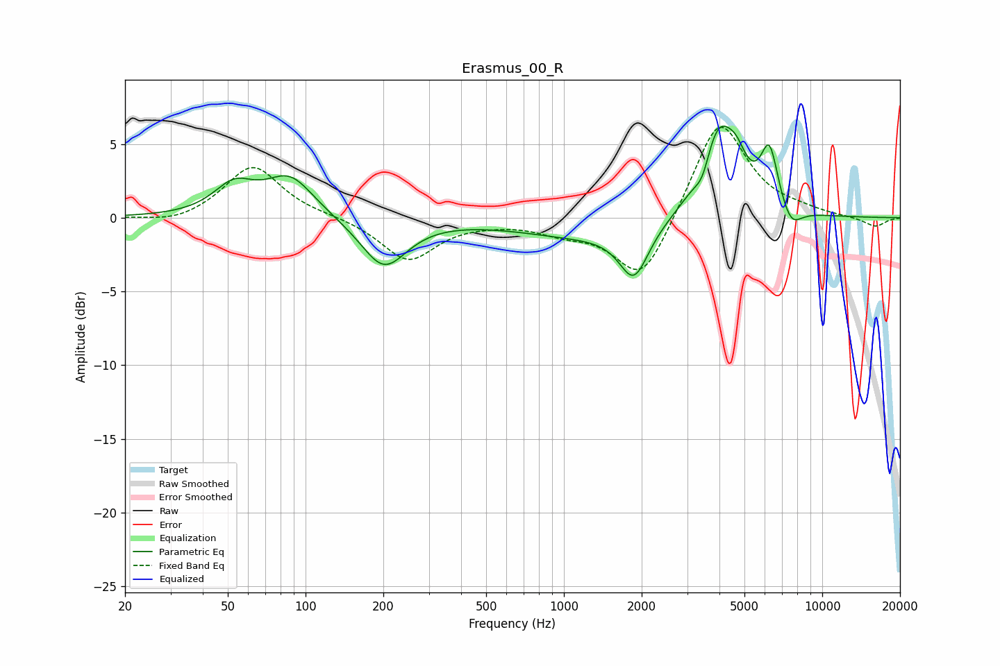

# Erasmus_00_R
See [usage instructions](https://github.com/jaakkopasanen/AutoEq#usage) for more options and info.

### Parametric EQs
Apply preamp of -6.3 dB when using parametric equalizer.

|   # | Type    |   Fc (Hz) |    Q |   Gain (dB) |
|-----|---------|-----------|------|-------------|
|   1 | Peaking |        53 | 1.82 |         2   |
|   2 | Peaking |        87 | 1.51 |         2.7 |
|   3 | Peaking |       201 | 1.59 |        -3.4 |
|   4 | Peaking |      1242 | 0.53 |        -1.3 |
|   5 | Peaking |      1867 | 2.53 |        -3.4 |
|   6 | Peaking |      3445 | 4.61 |        -1.5 |
|   7 | Peaking |      3957 | 1.9  |         6.5 |
|   8 | Peaking |      4668 | 4.07 |         1.2 |
|   9 | Peaking |      6247 | 4.05 |         4.1 |
|  10 | Peaking |      7562 | 3.27 |        -1.5 |

### Fixed Band EQs
When using fixed band (also called graphic) equalizer, apply preamp of **-6.2 dB** (if available) and set gains manually with these parameters.

|   # | Type    |   Fc (Hz) |    Q |   Gain (dB) |
|-----|---------|-----------|------|-------------|
|   1 | Peaking |        31 | 1.41 |        -0.5 |
|   2 | Peaking |        62 | 1.41 |         3.6 |
|   3 | Peaking |       125 | 1.41 |         0.1 |
|   4 | Peaking |       250 | 1.41 |        -2.9 |
|   5 | Peaking |       500 | 1.41 |        -0.1 |
|   6 | Peaking |      1000 | 1.41 |        -0.8 |
|   7 | Peaking |      2000 | 1.41 |        -4.5 |
|   8 | Peaking |      4000 | 1.41 |         6.9 |
|   9 | Peaking |      8000 | 1.41 |         0.3 |
|  10 | Peaking |     16000 | 1.41 |        -0.6 |

### Graphs

