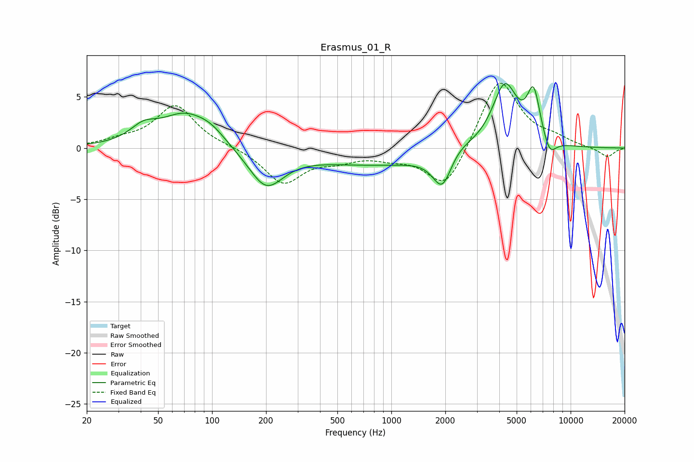

# Erasmus_01_R
See [usage instructions](https://github.com/jaakkopasanen/AutoEq#usage) for more options and info.

### Parametric EQs
Apply preamp of -6.4 dB when using parametric equalizer.

|   # | Type    |   Fc (Hz) |    Q |   Gain (dB) |
|-----|---------|-----------|------|-------------|
|   1 | Peaking |        41 | 1.93 |         1.3 |
|   2 | Peaking |        71 | 1.02 |         3.2 |
|   3 | Peaking |        99 | 1.8  |         0.9 |
|   4 | Peaking |       200 | 1.47 |        -3.7 |
|   5 | Peaking |       895 | 0.35 |        -1.6 |
|   6 | Peaking |      1929 | 2.6  |        -3.8 |
|   7 | Peaking |      2255 | 1.51 |         1.3 |
|   8 | Peaking |      4296 | 1.98 |         6.3 |
|   9 | Peaking |      6218 | 3.75 |         4.8 |
|  10 | Peaking |      7630 | 3.7  |        -1.7 |

### Fixed Band EQs
When using fixed band (also called graphic) equalizer, apply preamp of **-6.4 dB** (if available) and set gains manually with these parameters.

|   # | Type    |   Fc (Hz) |    Q |   Gain (dB) |
|-----|---------|-----------|------|-------------|
|   1 | Peaking |        31 | 1.41 |         0.6 |
|   2 | Peaking |        62 | 1.41 |         4.1 |
|   3 | Peaking |       125 | 1.41 |         0.1 |
|   4 | Peaking |       250 | 1.41 |        -3.4 |
|   5 | Peaking |       500 | 1.41 |        -0.9 |
|   6 | Peaking |      1000 | 1.41 |        -0.7 |
|   7 | Peaking |      2000 | 1.41 |        -4.2 |
|   8 | Peaking |      4000 | 1.41 |         7   |
|   9 | Peaking |      8000 | 1.41 |         0.7 |
|  10 | Peaking |     16000 | 1.41 |        -0.9 |

### Graphs

