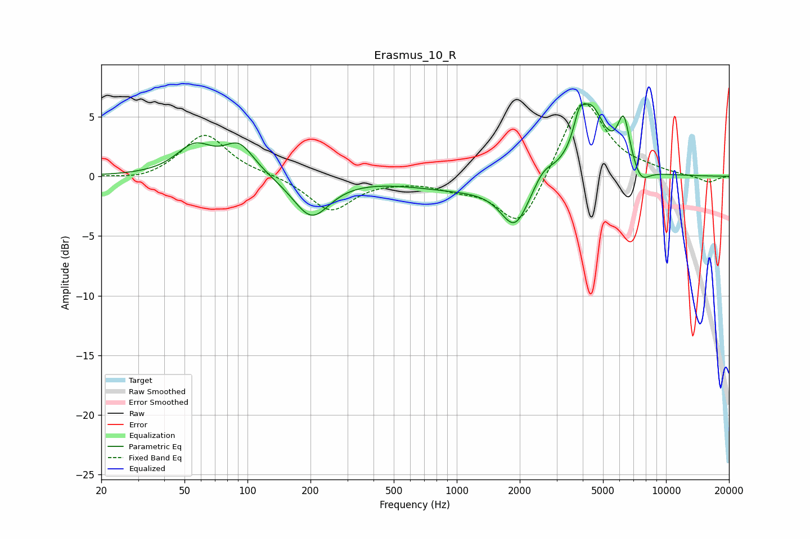

# Erasmus_10_R
See [usage instructions](https://github.com/jaakkopasanen/AutoEq#usage) for more options and info.

### Parametric EQs
Apply preamp of -6.1 dB when using parametric equalizer.

|   # | Type    |   Fc (Hz) |    Q |   Gain (dB) |
|-----|---------|-----------|------|-------------|
|   1 | Peaking |        56 | 1.65 |         2.4 |
|   2 | Peaking |        91 | 1.92 |         2.5 |
|   3 | Peaking |       202 | 1.62 |        -3.4 |
|   4 | Peaking |      1028 | 0.57 |        -1   |
|   5 | Peaking |      1897 | 2.06 |        -3.8 |
|   6 | Peaking |      2591 | 3.01 |         1.1 |
|   7 | Peaking |      3836 | 6    |         1.6 |
|   8 | Peaking |      4358 | 2.04 |         5.6 |
|   9 | Peaking |      6282 | 4.64 |         4   |
|  10 | Peaking |      7570 | 3.33 |        -1.3 |

### Fixed Band EQs
When using fixed band (also called graphic) equalizer, apply preamp of **-6.2 dB** (if available) and set gains manually with these parameters.

|   # | Type    |   Fc (Hz) |    Q |   Gain (dB) |
|-----|---------|-----------|------|-------------|
|   1 | Peaking |        31 | 1.41 |        -0.4 |
|   2 | Peaking |        62 | 1.41 |         3.6 |
|   3 | Peaking |       125 | 1.41 |         0.1 |
|   4 | Peaking |       250 | 1.41 |        -2.9 |
|   5 | Peaking |       500 | 1.41 |        -0.2 |
|   6 | Peaking |      1000 | 1.41 |        -0.8 |
|   7 | Peaking |      2000 | 1.41 |        -4.5 |
|   8 | Peaking |      4000 | 1.41 |         6.9 |
|   9 | Peaking |      8000 | 1.41 |         0.4 |
|  10 | Peaking |     16000 | 1.41 |        -0.6 |

### Graphs

