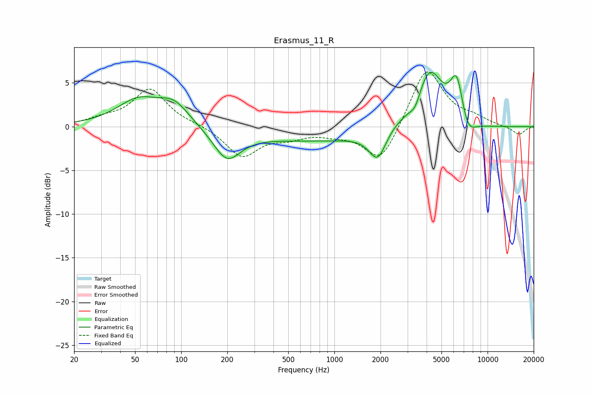

# Erasmus_11_R
See [usage instructions](https://github.com/jaakkopasanen/AutoEq#usage) for more options and info.

### Parametric EQs
Apply preamp of -6.3 dB when using parametric equalizer.

|   # | Type    |   Fc (Hz) |    Q |   Gain (dB) |
|-----|---------|-----------|------|-------------|
|   1 | Peaking |        52 | 1.01 |         2.9 |
|   2 | Peaking |        90 | 1.41 |         2.3 |
|   3 | Peaking |       199 | 1.62 |        -3.4 |
|   4 | Peaking |      1211 | 0.18 |        -1.7 |
|   5 | Peaking |      1920 | 2.47 |        -3.6 |
|   6 | Peaking |      2285 | 1.17 |         1.2 |
|   7 | Peaking |      3367 | 4.22 |        -1.2 |
|   8 | Peaking |      4189 | 1.56 |         7.1 |
|   9 | Peaking |      6296 | 3.12 |         5.3 |
|  10 | Peaking |      7366 | 2.62 |        -2.3 |

### Fixed Band EQs
When using fixed band (also called graphic) equalizer, apply preamp of **-6.3 dB** (if available) and set gains manually with these parameters.

|   # | Type    |   Fc (Hz) |    Q |   Gain (dB) |
|-----|---------|-----------|------|-------------|
|   1 | Peaking |        31 | 1.41 |         0.7 |
|   2 | Peaking |        62 | 1.41 |         4.2 |
|   3 | Peaking |       125 | 1.41 |         0.2 |
|   4 | Peaking |       250 | 1.41 |        -3.4 |
|   5 | Peaking |       500 | 1.41 |        -1   |
|   6 | Peaking |      1000 | 1.41 |        -0.6 |
|   7 | Peaking |      2000 | 1.41 |        -4.3 |
|   8 | Peaking |      4000 | 1.41 |         6.9 |
|   9 | Peaking |      8000 | 1.41 |         0.8 |
|  10 | Peaking |     16000 | 1.41 |        -1   |

### Graphs

