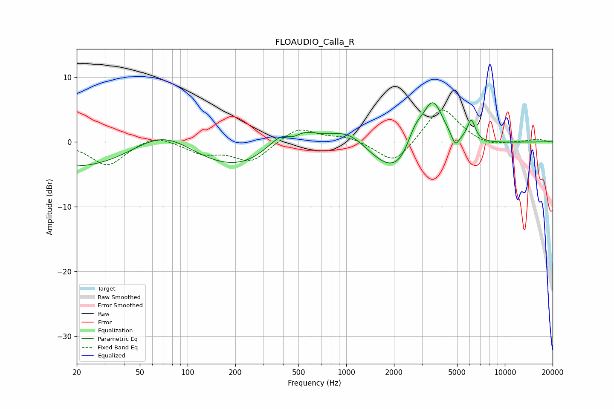

# FLOAUDIO_Calla_R
See [usage instructions](https://github.com/jaakkopasanen/AutoEq#usage) for more options and info.

### Parametric EQs
Apply preamp of -6.2 dB when using parametric equalizer.

|   # | Type    |   Fc (Hz) |    Q |   Gain (dB) |
|-----|---------|-----------|------|-------------|
|   1 | Peaking |        70 | 0.43 |        13   |
|   2 | Peaking |        80 | 0.18 |       -12.9 |
|   3 | Peaking |       448 | 1.14 |         8.6 |
|   4 | Peaking |       458 | 2.34 |        -3.6 |
|   5 | Peaking |      1032 | 1.04 |         3.6 |
|   6 | Peaking |      2230 | 0.78 |        -7   |
|   7 | Peaking |      2707 | 2.43 |         4.1 |
|   8 | Peaking |      3509 | 1.88 |         8.8 |
|   9 | Peaking |      4873 | 5.77 |        -1.9 |
|  10 | Peaking |      6139 | 5.27 |         3.4 |

### Fixed Band EQs
When using fixed band (also called graphic) equalizer, apply preamp of **-5.0 dB** (if available) and set gains manually with these parameters.

|   # | Type    |   Fc (Hz) |    Q |   Gain (dB) |
|-----|---------|-----------|------|-------------|
|   1 | Peaking |        31 | 1.41 |        -3.7 |
|   2 | Peaking |        62 | 1.41 |         1.4 |
|   3 | Peaking |       125 | 1.41 |        -1.6 |
|   4 | Peaking |       250 | 1.41 |        -3   |
|   5 | Peaking |       500 | 1.41 |         2.3 |
|   6 | Peaking |      1000 | 1.41 |         0.8 |
|   7 | Peaking |      2000 | 1.41 |        -3.6 |
|   8 | Peaking |      4000 | 1.41 |         5.6 |
|   9 | Peaking |      8000 | 1.41 |        -0.8 |
|  10 | Peaking |     16000 | 1.41 |         0.4 |

### Graphs

