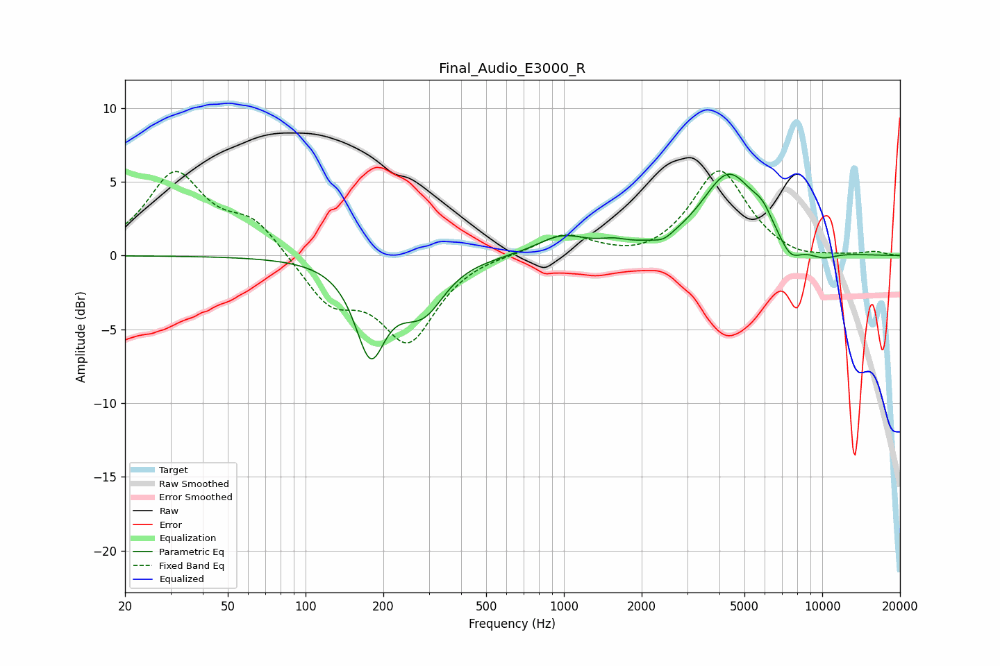

# Final_Audio_E3000_R
See [usage instructions](https://github.com/jaakkopasanen/AutoEq#usage) for more options and info.

### Parametric EQs
Apply preamp of -5.6 dB when using parametric equalizer.

|   # | Type    |   Fc (Hz) |    Q |   Gain (dB) |
|-----|---------|-----------|------|-------------|
|   1 | Peaking |       178 | 2.42 |        -6.1 |
|   2 | Peaking |       251 | 1.87 |        -1.1 |
|   3 | Peaking |       293 | 1.82 |        -2.5 |
|   4 | Peaking |       982 | 1.47 |         1.3 |
|   5 | Peaking |      1557 | 2.58 |         0.4 |
|   6 | Peaking |      2432 | 3.83 |        -0.4 |
|   7 | Peaking |      4349 | 1.33 |         5.4 |
|   8 | Peaking |      5880 | 3.42 |         1   |
|   9 | Peaking |      7524 | 3.05 |        -1.3 |
|  10 | Peaking |     10000 | 2.19 |        -0.5 |

### Fixed Band EQs
When using fixed band (also called graphic) equalizer, apply preamp of **-5.8 dB** (if available) and set gains manually with these parameters.

|   # | Type    |   Fc (Hz) |    Q |   Gain (dB) |
|-----|---------|-----------|------|-------------|
|   1 | Peaking |        31 | 1.41 |         5.4 |
|   2 | Peaking |        62 | 1.41 |         2.2 |
|   3 | Peaking |       125 | 1.41 |        -3   |
|   4 | Peaking |       250 | 1.41 |        -5.6 |
|   5 | Peaking |       500 | 1.41 |         0.2 |
|   6 | Peaking |      1000 | 1.41 |         1.5 |
|   7 | Peaking |      2000 | 1.41 |        -0.4 |
|   8 | Peaking |      4000 | 1.41 |         5.8 |
|   9 | Peaking |      8000 | 1.41 |        -0.4 |
|  10 | Peaking |     16000 | 1.41 |         0.2 |

### Graphs

