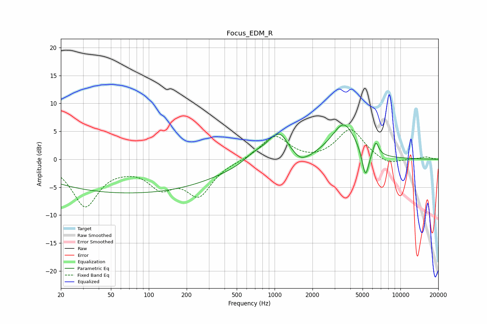

# Focus_EDM_R
See [usage instructions](https://github.com/jaakkopasanen/AutoEq#usage) for more options and info.

### Parametric EQs
Apply preamp of -6.2 dB when using parametric equalizer.

|   # | Type    |   Fc (Hz) |    Q |   Gain (dB) |
|-----|---------|-----------|------|-------------|
|   1 | Peaking |        70 | 0.18 |        -6   |
|   2 | Peaking |       678 | 1.98 |         1   |
|   3 | Peaking |       862 | 1.81 |        -1.5 |
|   4 | Peaking |       943 | 1.43 |         4.8 |
|   5 | Peaking |      1126 | 2.77 |         1.8 |
|   6 | Peaking |      1598 | 2.65 |        -1.4 |
|   7 | Peaking |      1909 | 2.49 |        -0.5 |
|   8 | Peaking |      3549 | 1.46 |         6.3 |
|   9 | Peaking |      5273 | 5.03 |        -5.2 |
|  10 | Peaking |      6374 | 6    |         2.5 |

### Fixed Band EQs
When using fixed band (also called graphic) equalizer, apply preamp of **-5.4 dB** (if available) and set gains manually with these parameters.

|   # | Type    |   Fc (Hz) |    Q |   Gain (dB) |
|-----|---------|-----------|------|-------------|
|   1 | Peaking |        31 | 1.41 |        -8.2 |
|   2 | Peaking |        62 | 1.41 |        -0.6 |
|   3 | Peaking |       125 | 1.41 |        -4.3 |
|   4 | Peaking |       250 | 1.41 |        -6   |
|   5 | Peaking |       500 | 1.41 |        -0.1 |
|   6 | Peaking |      1000 | 1.41 |         4.3 |
|   7 | Peaking |      2000 | 1.41 |        -0.4 |
|   8 | Peaking |      4000 | 1.41 |         5.4 |
|   9 | Peaking |      8000 | 1.41 |        -1.2 |
|  10 | Peaking |     16000 | 1.41 |         0.4 |

### Graphs

