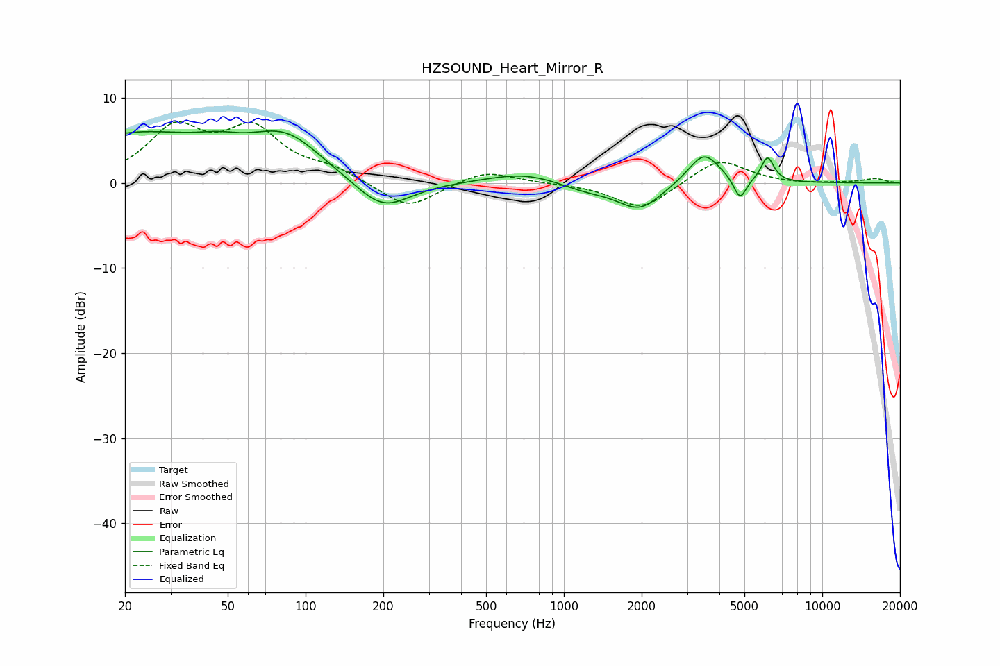

# HZSOUND_Heart_Mirror_R
See [usage instructions](https://github.com/jaakkopasanen/AutoEq#usage) for more options and info.

### Parametric EQs
Apply preamp of -6.2 dB when using parametric equalizer.

|   # | Type    |   Fc (Hz) |    Q |   Gain (dB) |
|-----|---------|-----------|------|-------------|
|   1 | Peaking |        22 | 0.46 |         5.5 |
|   2 | Peaking |        46 | 1.67 |         0.9 |
|   3 | Peaking |        84 | 1.01 |         4.7 |
|   4 | Peaking |       199 | 1.31 |        -3.7 |
|   5 | Peaking |       707 | 0.99 |         1.3 |
|   6 | Peaking |      1216 | 1.3  |        -0.9 |
|   7 | Peaking |      1967 | 1.66 |        -3.1 |
|   8 | Peaking |      3484 | 2.27 |         3.8 |
|   9 | Peaking |      4804 | 5.78 |        -2.6 |
|  10 | Peaking |      6142 | 5.66 |         2.9 |

### Fixed Band EQs
When using fixed band (also called graphic) equalizer, apply preamp of **-7.3 dB** (if available) and set gains manually with these parameters.

|   # | Type    |   Fc (Hz) |    Q |   Gain (dB) |
|-----|---------|-----------|------|-------------|
|   1 | Peaking |        31 | 1.41 |         6   |
|   2 | Peaking |        62 | 1.41 |         5.8 |
|   3 | Peaking |       125 | 1.41 |         1.4 |
|   4 | Peaking |       250 | 1.41 |        -3.2 |
|   5 | Peaking |       500 | 1.41 |         1.5 |
|   6 | Peaking |      1000 | 1.41 |        -0   |
|   7 | Peaking |      2000 | 1.41 |        -3.2 |
|   8 | Peaking |      4000 | 1.41 |         2.9 |
|   9 | Peaking |      8000 | 1.41 |        -0.1 |
|  10 | Peaking |     16000 | 1.41 |         0.5 |

### Graphs

