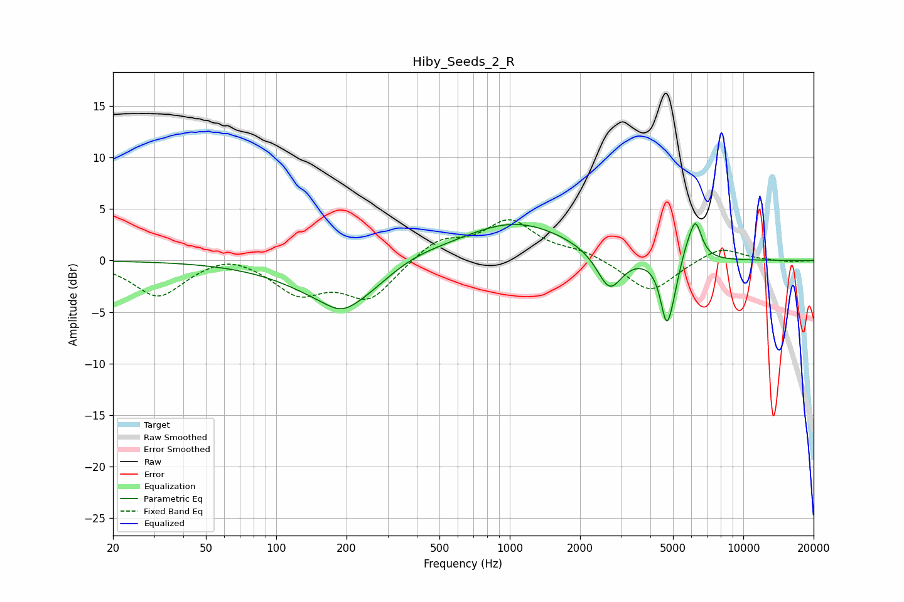

# Hiby_Seeds_2_R
See [usage instructions](https://github.com/jaakkopasanen/AutoEq#usage) for more options and info.

### Parametric EQs
Apply preamp of -3.7 dB when using parametric equalizer.

|   # | Type    |   Fc (Hz) |    Q |   Gain (dB) |
|-----|---------|-----------|------|-------------|
|   1 | Peaking |       181 | 3.23 |        -0.3 |
|   2 | Peaking |       201 | 0.74 |        -4.9 |
|   3 | Peaking |       202 | 2.86 |        -0.4 |
|   4 | Peaking |       361 | 0.9  |         1.3 |
|   5 | Peaking |      1053 | 0.6  |         3.8 |
|   6 | Peaking |      2674 | 2.63 |        -3.7 |
|   7 | Peaking |      4697 | 5.16 |        -5.9 |
|   8 | Peaking |      5025 | 5.99 |        -1.1 |
|   9 | Peaking |      5698 | 6    |         0.7 |
|  10 | Peaking |      6232 | 4.94 |         3.8 |

### Fixed Band EQs
When using fixed band (also called graphic) equalizer, apply preamp of **-4.1 dB** (if available) and set gains manually with these parameters.

|   # | Type    |   Fc (Hz) |    Q |   Gain (dB) |
|-----|---------|-----------|------|-------------|
|   1 | Peaking |        31 | 1.41 |        -3.5 |
|   2 | Peaking |        62 | 1.41 |         0.9 |
|   3 | Peaking |       125 | 1.41 |        -3   |
|   4 | Peaking |       250 | 1.41 |        -3.6 |
|   5 | Peaking |       500 | 1.41 |         2   |
|   6 | Peaking |      1000 | 1.41 |         3.7 |
|   7 | Peaking |      2000 | 1.41 |         0.8 |
|   8 | Peaking |      4000 | 1.41 |        -3.2 |
|   9 | Peaking |      8000 | 1.41 |         1.4 |
|  10 | Peaking |     16000 | 1.41 |        -0.2 |

### Graphs

