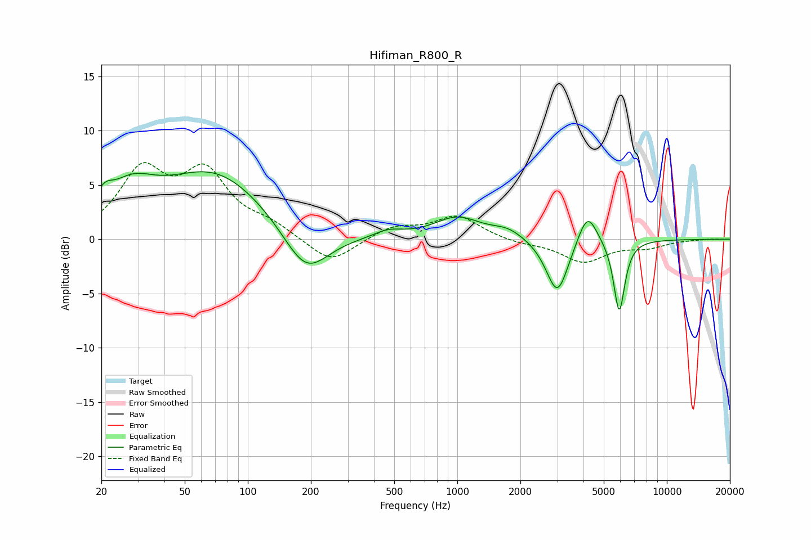

# Hifiman_R800_R
See [usage instructions](https://github.com/jaakkopasanen/AutoEq#usage) for more options and info.

### Parametric EQs
Apply preamp of -6.3 dB when using parametric equalizer.

|   # | Type    |   Fc (Hz) |    Q |   Gain (dB) |
|-----|---------|-----------|------|-------------|
|   1 | Peaking |        21 | 3.51 |         1.6 |
|   2 | Peaking |        28 | 1.24 |         3.1 |
|   3 | Peaking |        69 | 0.55 |         6.1 |
|   4 | Peaking |       189 | 1.29 |        -4.5 |
|   5 | Peaking |       468 | 2.11 |         0.6 |
|   6 | Peaking |       999 | 1.27 |         2   |
|   7 | Peaking |      1739 | 1.86 |         0.8 |
|   8 | Peaking |      3001 | 2.65 |        -5.2 |
|   9 | Peaking |      4177 | 3.05 |         3.1 |
|  10 | Peaking |      5925 | 5.19 |        -6.7 |

### Fixed Band EQs
When using fixed band (also called graphic) equalizer, apply preamp of **-7.2 dB** (if available) and set gains manually with these parameters.

|   # | Type    |   Fc (Hz) |    Q |   Gain (dB) |
|-----|---------|-----------|------|-------------|
|   1 | Peaking |        31 | 1.41 |         5.9 |
|   2 | Peaking |        62 | 1.41 |         5.6 |
|   3 | Peaking |       125 | 1.41 |         1.1 |
|   4 | Peaking |       250 | 1.41 |        -2.3 |
|   5 | Peaking |       500 | 1.41 |         1.1 |
|   6 | Peaking |      1000 | 1.41 |         2.1 |
|   7 | Peaking |      2000 | 1.41 |        -0.4 |
|   8 | Peaking |      4000 | 1.41 |        -2   |
|   9 | Peaking |      8000 | 1.41 |        -0.7 |
|  10 | Peaking |     16000 | 1.41 |         0   |

### Graphs

