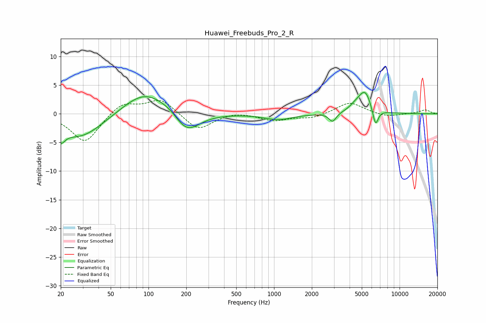

# Huawei_Freebuds_Pro_2_R
See [usage instructions](https://github.com/jaakkopasanen/AutoEq#usage) for more options and info.

### Parametric EQs
Apply preamp of -3.8 dB when using parametric equalizer.

|   # | Type    |   Fc (Hz) |    Q |   Gain (dB) |
|-----|---------|-----------|------|-------------|
|   1 | Peaking |        20 | 4.41 |        -2.2 |
|   2 | Peaking |        29 | 0.77 |        -4.3 |
|   3 | Peaking |        94 | 0.81 |         4.2 |
|   4 | Peaking |       151 | 1.78 |         0.6 |
|   5 | Peaking |       200 | 1.35 |        -3.9 |
|   6 | Peaking |      1081 | 1.27 |        -1   |
|   7 | Peaking |      2928 | 5    |        -1.5 |
|   8 | Peaking |      4481 | 2.71 |         1   |
|   9 | Peaking |      5309 | 2.8  |         3.7 |
|  10 | Peaking |      6422 | 5.97 |        -3.1 |

### Fixed Band EQs
When using fixed band (also called graphic) equalizer, apply preamp of **-2.4 dB** (if available) and set gains manually with these parameters.

|   # | Type    |   Fc (Hz) |    Q |   Gain (dB) |
|-----|---------|-----------|------|-------------|
|   1 | Peaking |        31 | 1.41 |        -5.1 |
|   2 | Peaking |        62 | 1.41 |         2.1 |
|   3 | Peaking |       125 | 1.41 |         2.6 |
|   4 | Peaking |       250 | 1.41 |        -2.9 |
|   5 | Peaking |       500 | 1.41 |         0.4 |
|   6 | Peaking |      1000 | 1.41 |        -1.2 |
|   7 | Peaking |      2000 | 1.41 |        -0.8 |
|   8 | Peaking |      4000 | 1.41 |         2.1 |
|   9 | Peaking |      8000 | 1.41 |        -0.6 |
|  10 | Peaking |     16000 | 1.41 |         0.7 |

### Graphs

