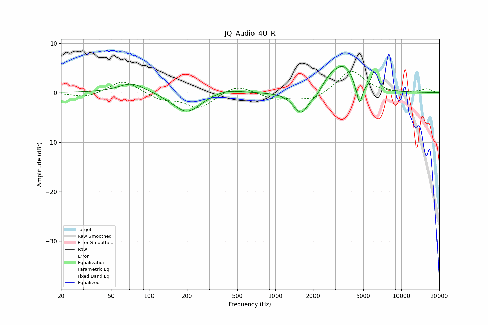

# JQ_Audio_4U_R
See [usage instructions](https://github.com/jaakkopasanen/AutoEq#usage) for more options and info.

### Parametric EQs
Apply preamp of -5.4 dB when using parametric equalizer.

|   # | Type    |   Fc (Hz) |    Q |   Gain (dB) |
|-----|---------|-----------|------|-------------|
|   1 | Peaking |        73 | 1.34 |         2.1 |
|   2 | Peaking |       187 | 0.95 |        -0.2 |
|   3 | Peaking |       199 | 1.33 |        -4   |
|   4 | Peaking |       408 | 1.18 |         0.9 |
|   5 | Peaking |      1608 | 2.35 |        -4.7 |
|   6 | Peaking |      2110 | 3.7  |        -0.9 |
|   7 | Peaking |      2646 | 3.07 |         0.8 |
|   8 | Peaking |      3425 | 1.48 |         5.7 |
|   9 | Peaking |      4645 | 5.86 |        -4.9 |
|  10 | Peaking |      6135 | 5.67 |         3.4 |

### Fixed Band EQs
When using fixed band (also called graphic) equalizer, apply preamp of **-4.4 dB** (if available) and set gains manually with these parameters.

|   # | Type    |   Fc (Hz) |    Q |   Gain (dB) |
|-----|---------|-----------|------|-------------|
|   1 | Peaking |        31 | 1.41 |        -1.1 |
|   2 | Peaking |        62 | 1.41 |         2.7 |
|   3 | Peaking |       125 | 1.41 |        -1.3 |
|   4 | Peaking |       250 | 1.41 |        -3.1 |
|   5 | Peaking |       500 | 1.41 |         1.8 |
|   6 | Peaking |      1000 | 1.41 |        -1.3 |
|   7 | Peaking |      2000 | 1.41 |        -1.6 |
|   8 | Peaking |      4000 | 1.41 |         4.6 |
|   9 | Peaking |      8000 | 1.41 |        -0.2 |
|  10 | Peaking |     16000 | 1.41 |         0.7 |

### Graphs

