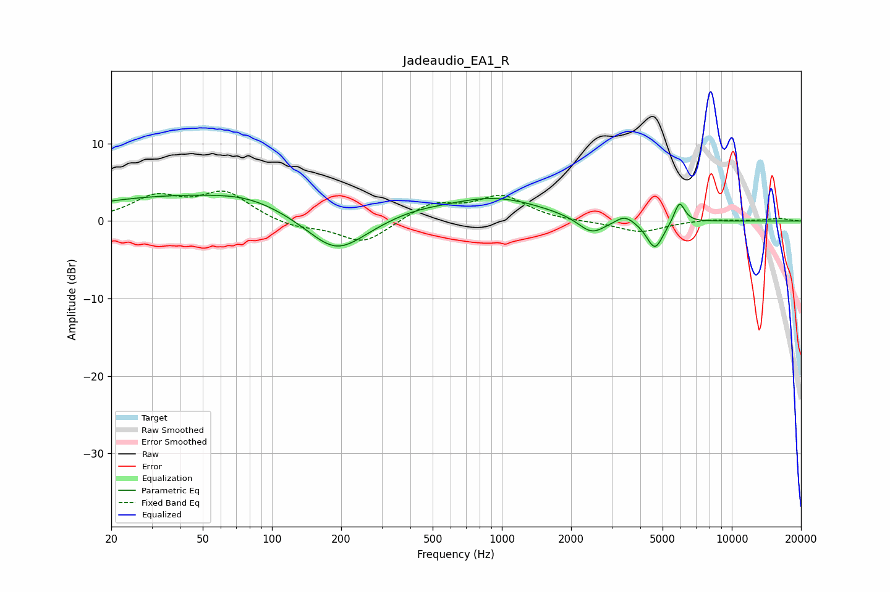

# Jadeaudio_EA1_R
See [usage instructions](https://github.com/jaakkopasanen/AutoEq#usage) for more options and info.

### Parametric EQs
Apply preamp of -3.4 dB when using parametric equalizer.

|   # | Type    |   Fc (Hz) |    Q |   Gain (dB) |
|-----|---------|-----------|------|-------------|
|   1 | Peaking |        41 | 0.31 |         3.2 |
|   2 | Peaking |        79 | 0.99 |         0.9 |
|   3 | Peaking |       190 | 1.1  |        -5   |
|   4 | Peaking |       412 | 1.07 |         0.8 |
|   5 | Peaking |       928 | 0.65 |         2.9 |
|   6 | Peaking |      2453 | 2.43 |        -2   |
|   7 | Peaking |      2794 | 1.28 |        -0.3 |
|   8 | Peaking |      3424 | 3.5  |         1.1 |
|   9 | Peaking |      4631 | 3.81 |        -3.7 |
|  10 | Peaking |      5922 | 6    |         2.8 |

### Fixed Band EQs
When using fixed band (also called graphic) equalizer, apply preamp of **-4.0 dB** (if available) and set gains manually with these parameters.

|   # | Type    |   Fc (Hz) |    Q |   Gain (dB) |
|-----|---------|-----------|------|-------------|
|   1 | Peaking |        31 | 1.41 |         2.9 |
|   2 | Peaking |        62 | 1.41 |         3.5 |
|   3 | Peaking |       125 | 1.41 |        -0.9 |
|   4 | Peaking |       250 | 1.41 |        -2.9 |
|   5 | Peaking |       500 | 1.41 |         2.2 |
|   6 | Peaking |      1000 | 1.41 |         3.1 |
|   7 | Peaking |      2000 | 1.41 |        -0.1 |
|   8 | Peaking |      4000 | 1.41 |        -1.5 |
|   9 | Peaking |      8000 | 1.41 |         0.3 |
|  10 | Peaking |     16000 | 1.41 |         0.3 |

### Graphs

