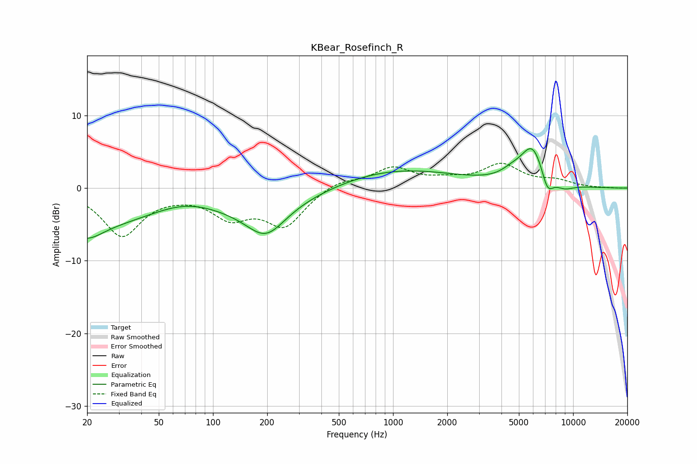

# KBear_Rosefinch_R
See [usage instructions](https://github.com/jaakkopasanen/AutoEq#usage) for more options and info.

### Parametric EQs
Apply preamp of -5.5 dB when using parametric equalizer.

|   # | Type    |   Fc (Hz) |    Q |   Gain (dB) |
|-----|---------|-----------|------|-------------|
|   1 | Peaking |        20 | 1.65 |        -2   |
|   2 | Peaking |        35 | 0.18 |        -5.8 |
|   3 | Peaking |        70 | 0.68 |         2.7 |
|   4 | Peaking |       197 | 1.32 |        -4.1 |
|   5 | Peaking |       236 | 0.37 |        -4.4 |
|   6 | Peaking |       363 | 0.19 |         4.7 |
|   7 | Peaking |      4531 | 2.45 |         0.8 |
|   8 | Peaking |      5956 | 1.99 |         5.5 |
|   9 | Peaking |      7196 | 3.98 |        -2.9 |
|  10 | Peaking |      8913 | 2.3  |        -0.9 |

### Fixed Band EQs
When using fixed band (also called graphic) equalizer, apply preamp of **-3.5 dB** (if available) and set gains manually with these parameters.

|   # | Type    |   Fc (Hz) |    Q |   Gain (dB) |
|-----|---------|-----------|------|-------------|
|   1 | Peaking |        31 | 1.41 |        -6.4 |
|   2 | Peaking |        62 | 1.41 |        -0.3 |
|   3 | Peaking |       125 | 1.41 |        -3.6 |
|   4 | Peaking |       250 | 1.41 |        -5   |
|   5 | Peaking |       500 | 1.41 |         1.1 |
|   6 | Peaking |      1000 | 1.41 |         2.7 |
|   7 | Peaking |      2000 | 1.41 |         0.8 |
|   8 | Peaking |      4000 | 1.41 |         3.1 |
|   9 | Peaking |      8000 | 1.41 |         0.9 |
|  10 | Peaking |     16000 | 1.41 |        -0   |

### Graphs

