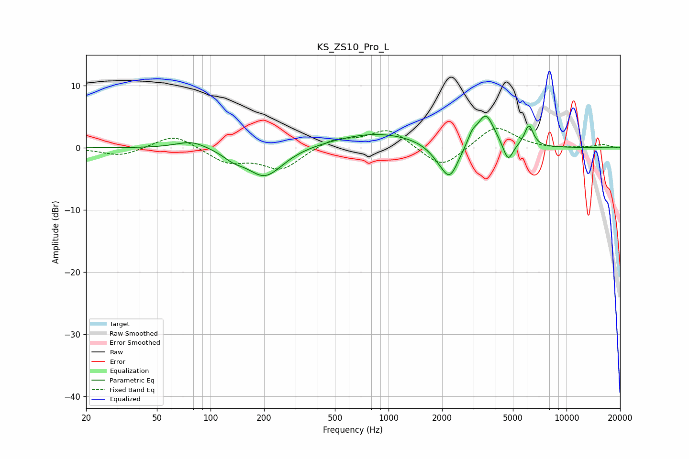

# KS_ZS10_Pro_L
See [usage instructions](https://github.com/jaakkopasanen/AutoEq#usage) for more options and info.

### Parametric EQs
Apply preamp of -5.2 dB when using parametric equalizer.

|   # | Type    |   Fc (Hz) |    Q |   Gain (dB) |
|-----|---------|-----------|------|-------------|
|   1 | Peaking |        79 | 1.6  |         1.3 |
|   2 | Peaking |       134 | 2.53 |        -1   |
|   3 | Peaking |       202 | 1.39 |        -4.8 |
|   4 | Peaking |       865 | 0.55 |         2.4 |
|   5 | Peaking |      1915 | 2.28 |        -1.3 |
|   6 | Peaking |      2210 | 2.83 |        -5.1 |
|   7 | Peaking |      2951 | 5.74 |         1.4 |
|   8 | Peaking |      3516 | 2.94 |         5.3 |
|   9 | Peaking |      4696 | 5.12 |        -3.1 |
|  10 | Peaking |      6150 | 5.58 |         3.4 |

### Fixed Band EQs
When using fixed band (also called graphic) equalizer, apply preamp of **-3.2 dB** (if available) and set gains manually with these parameters.

|   # | Type    |   Fc (Hz) |    Q |   Gain (dB) |
|-----|---------|-----------|------|-------------|
|   1 | Peaking |        31 | 1.41 |        -1.4 |
|   2 | Peaking |        62 | 1.41 |         2.3 |
|   3 | Peaking |       125 | 1.41 |        -2.3 |
|   4 | Peaking |       250 | 1.41 |        -3.4 |
|   5 | Peaking |       500 | 1.41 |         1.5 |
|   6 | Peaking |      1000 | 1.41 |         3.1 |
|   7 | Peaking |      2000 | 1.41 |        -3.6 |
|   8 | Peaking |      4000 | 1.41 |         3.7 |
|   9 | Peaking |      8000 | 1.41 |        -0.2 |
|  10 | Peaking |     16000 | 1.41 |         0.5 |

### Graphs

