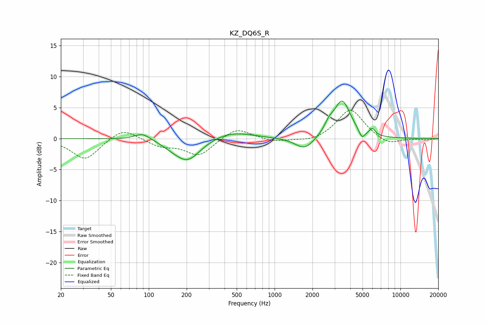

# KZ_DQ6S_R
See [usage instructions](https://github.com/jaakkopasanen/AutoEq#usage) for more options and info.

### Parametric EQs
Apply preamp of -6.2 dB when using parametric equalizer.

|   # | Type    |   Fc (Hz) |    Q |   Gain (dB) |
|-----|---------|-----------|------|-------------|
|   1 | Peaking |        89 | 2.26 |         1.1 |
|   2 | Peaking |       154 | 1.8  |        -0.5 |
|   3 | Peaking |       200 | 1.4  |        -0.2 |
|   4 | Peaking |       204 | 1.4  |        -3.3 |
|   5 | Peaking |       454 | 0.87 |         1.2 |
|   6 | Peaking |      1738 | 1.87 |        -2.1 |
|   7 | Peaking |      2703 | 3.87 |         1.3 |
|   8 | Peaking |      3441 | 2.13 |         6   |
|   9 | Peaking |      4938 | 5.97 |        -1.4 |
|  10 | Peaking |      5987 | 6    |         1.1 |

### Fixed Band EQs
When using fixed band (also called graphic) equalizer, apply preamp of **-4.7 dB** (if available) and set gains manually with these parameters.

|   # | Type    |   Fc (Hz) |    Q |   Gain (dB) |
|-----|---------|-----------|------|-------------|
|   1 | Peaking |        31 | 1.41 |        -3.4 |
|   2 | Peaking |        62 | 1.41 |         1.9 |
|   3 | Peaking |       125 | 1.41 |        -1.2 |
|   4 | Peaking |       250 | 1.41 |        -2.7 |
|   5 | Peaking |       500 | 1.41 |         1.9 |
|   6 | Peaking |      1000 | 1.41 |        -0.6 |
|   7 | Peaking |      2000 | 1.41 |        -0.6 |
|   8 | Peaking |      4000 | 1.41 |         4.8 |
|   9 | Peaking |      8000 | 1.41 |        -1.1 |
|  10 | Peaking |     16000 | 1.41 |        -0.2 |

### Graphs

