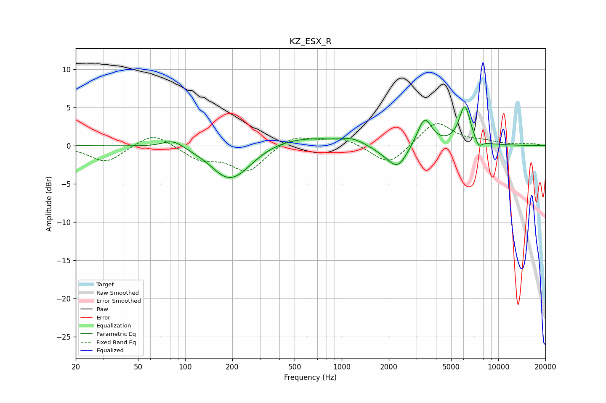

# KZ_ESX_R
See [usage instructions](https://github.com/jaakkopasanen/AutoEq#usage) for more options and info.

### Parametric EQs
Apply preamp of -5.2 dB when using parametric equalizer.

|   # | Type    |   Fc (Hz) |    Q |   Gain (dB) |
|-----|---------|-----------|------|-------------|
|   1 | Peaking |        84 | 2.06 |         1.1 |
|   2 | Peaking |       173 | 1.8  |        -0.7 |
|   3 | Peaking |       203 | 1.09 |        -4.3 |
|   4 | Peaking |       501 | 0.5  |         1.4 |
|   5 | Peaking |      1169 | 2.4  |         0.6 |
|   6 | Peaking |      1896 | 1.9  |        -0.7 |
|   7 | Peaking |      2286 | 2.34 |        -2.8 |
|   8 | Peaking |      3382 | 3.13 |         3.7 |
|   9 | Peaking |      6111 | 3.78 |         5.1 |
|  10 | Peaking |      7482 | 5.6  |        -1.1 |

### Fixed Band EQs
When using fixed band (also called graphic) equalizer, apply preamp of **-3.0 dB** (if available) and set gains manually with these parameters.

|   # | Type    |   Fc (Hz) |    Q |   Gain (dB) |
|-----|---------|-----------|------|-------------|
|   1 | Peaking |        31 | 1.41 |        -2.2 |
|   2 | Peaking |        62 | 1.41 |         1.9 |
|   3 | Peaking |       125 | 1.41 |        -1.7 |
|   4 | Peaking |       250 | 1.41 |        -3.3 |
|   5 | Peaking |       500 | 1.41 |         1.4 |
|   6 | Peaking |      1000 | 1.41 |         1.1 |
|   7 | Peaking |      2000 | 1.41 |        -2.7 |
|   8 | Peaking |      4000 | 1.41 |         3.2 |
|   9 | Peaking |      8000 | 1.41 |         0.4 |
|  10 | Peaking |     16000 | 1.41 |         0.3 |

### Graphs

