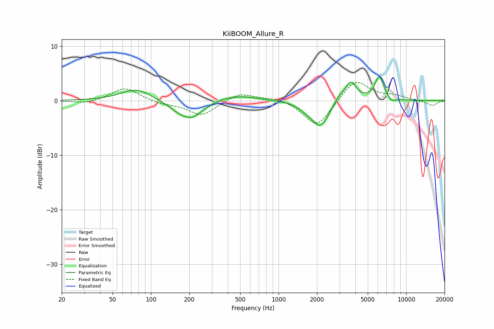

# KiiBOOM_Allure_R
See [usage instructions](https://github.com/jaakkopasanen/AutoEq#usage) for more options and info.

### Parametric EQs
Apply preamp of -4.5 dB when using parametric equalizer.

|   # | Type    |   Fc (Hz) |    Q |   Gain (dB) |
|-----|---------|-----------|------|-------------|
|   1 | Peaking |        76 | 1.21 |         2.2 |
|   2 | Peaking |       159 | 1.83 |        -1.1 |
|   3 | Peaking |       209 | 1.65 |        -3   |
|   4 | Peaking |       471 | 0.98 |         1   |
|   5 | Peaking |      1655 | 2.61 |        -0.8 |
|   6 | Peaking |      2127 | 2.13 |        -4.6 |
|   7 | Peaking |      2966 | 4.13 |         1   |
|   8 | Peaking |      3672 | 3.08 |         3.6 |
|   9 | Peaking |      6154 | 3.9  |         4.4 |
|  10 | Peaking |      7676 | 4.97 |        -0.8 |

### Fixed Band EQs
When using fixed band (also called graphic) equalizer, apply preamp of **-3.4 dB** (if available) and set gains manually with these parameters.

|   # | Type    |   Fc (Hz) |    Q |   Gain (dB) |
|-----|---------|-----------|------|-------------|
|   1 | Peaking |        31 | 1.41 |        -0.6 |
|   2 | Peaking |        62 | 1.41 |         2.4 |
|   3 | Peaking |       125 | 1.41 |        -0.6 |
|   4 | Peaking |       250 | 1.41 |        -2.8 |
|   5 | Peaking |       500 | 1.41 |         1.6 |
|   6 | Peaking |      1000 | 1.41 |         0.6 |
|   7 | Peaking |      2000 | 1.41 |        -5   |
|   8 | Peaking |      4000 | 1.41 |         4   |
|   9 | Peaking |      8000 | 1.41 |         0.8 |
|  10 | Peaking |     16000 | 1.41 |        -0.9 |

### Graphs

