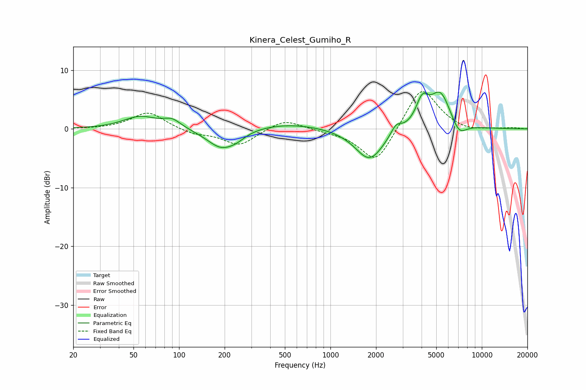

# Kinera_Celest_Gumiho_R
See [usage instructions](https://github.com/jaakkopasanen/AutoEq#usage) for more options and info.

### Parametric EQs
Apply preamp of -6.4 dB when using parametric equalizer.

|   # | Type    |   Fc (Hz) |    Q |   Gain (dB) |
|-----|---------|-----------|------|-------------|
|   1 | Peaking |        55 | 1.28 |         2.1 |
|   2 | Peaking |        90 | 2.38 |         1.4 |
|   3 | Peaking |       191 | 1.44 |        -3.4 |
|   4 | Peaking |       241 | 2.5  |        -0.7 |
|   5 | Peaking |       518 | 0.6  |         1   |
|   6 | Peaking |      1813 | 1.49 |        -5.5 |
|   7 | Peaking |      2713 | 4.06 |         1.7 |
|   8 | Peaking |      4038 | 3.43 |         4   |
|   9 | Peaking |      5325 | 1.97 |         6.3 |
|  10 | Peaking |      7048 | 2.67 |        -2.5 |

### Fixed Band EQs
When using fixed band (also called graphic) equalizer, apply preamp of **-6.4 dB** (if available) and set gains manually with these parameters.

|   # | Type    |   Fc (Hz) |    Q |   Gain (dB) |
|-----|---------|-----------|------|-------------|
|   1 | Peaking |        31 | 1.41 |        -0   |
|   2 | Peaking |        62 | 1.41 |         2.9 |
|   3 | Peaking |       125 | 1.41 |        -0.8 |
|   4 | Peaking |       250 | 1.41 |        -2.8 |
|   5 | Peaking |       500 | 1.41 |         1.8 |
|   6 | Peaking |      1000 | 1.41 |        -0.3 |
|   7 | Peaking |      2000 | 1.41 |        -6.1 |
|   8 | Peaking |      4000 | 1.41 |         7.5 |
|   9 | Peaking |      8000 | 1.41 |        -0.6 |
|  10 | Peaking |     16000 | 1.41 |         0.2 |

### Graphs

