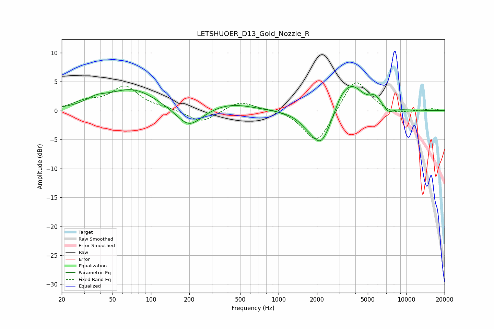

# LETSHUOER_D13_Gold_Nozzle_R
See [usage instructions](https://github.com/jaakkopasanen/AutoEq#usage) for more options and info.

### Parametric EQs
Apply preamp of -4.3 dB when using parametric equalizer.

|   # | Type    |   Fc (Hz) |    Q |   Gain (dB) |
|-----|---------|-----------|------|-------------|
|   1 | Peaking |        37 | 1.84 |         1   |
|   2 | Peaking |        72 | 0.74 |         3.7 |
|   3 | Peaking |       199 | 1.4  |        -3.5 |
|   4 | Peaking |       418 | 0.82 |         1.3 |
|   5 | Peaking |      1652 | 2.5  |        -0.8 |
|   6 | Peaking |      2154 | 1.74 |        -6.3 |
|   7 | Peaking |      3090 | 2.57 |         1.6 |
|   8 | Peaking |      3751 | 1.55 |         4.5 |
|   9 | Peaking |      5723 | 3.3  |         1.6 |
|  10 | Peaking |      7327 | 3.73 |        -1   |

### Fixed Band EQs
When using fixed band (also called graphic) equalizer, apply preamp of **-4.9 dB** (if available) and set gains manually with these parameters.

|   # | Type    |   Fc (Hz) |    Q |   Gain (dB) |
|-----|---------|-----------|------|-------------|
|   1 | Peaking |        31 | 1.41 |         1.4 |
|   2 | Peaking |        62 | 1.41 |         4   |
|   3 | Peaking |       125 | 1.41 |         0.3 |
|   4 | Peaking |       250 | 1.41 |        -2.1 |
|   5 | Peaking |       500 | 1.41 |         1.7 |
|   6 | Peaking |      1000 | 1.41 |         0.4 |
|   7 | Peaking |      2000 | 1.41 |        -6   |
|   8 | Peaking |      4000 | 1.41 |         6   |
|   9 | Peaking |      8000 | 1.41 |        -0.8 |
|  10 | Peaking |     16000 | 1.41 |         0.3 |

### Graphs

