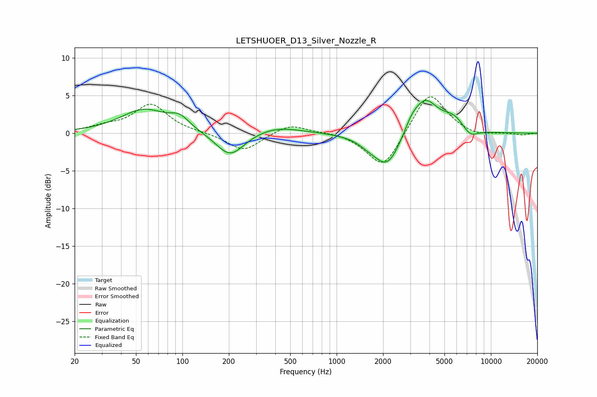

# LETSHUOER_D13_Silver_Nozzle_R
See [usage instructions](https://github.com/jaakkopasanen/AutoEq#usage) for more options and info.

### Parametric EQs
Apply preamp of -4.5 dB when using parametric equalizer.

|   # | Type    |   Fc (Hz) |    Q |   Gain (dB) |
|-----|---------|-----------|------|-------------|
|   1 | Peaking |        56 | 0.93 |         3.1 |
|   2 | Peaking |        96 | 2.29 |         1.4 |
|   3 | Peaking |       204 | 1.53 |        -3.3 |
|   4 | Peaking |       404 | 0.91 |         1   |
|   5 | Peaking |      1596 | 2.2  |        -0.6 |
|   6 | Peaking |      2133 | 1.61 |        -4.7 |
|   7 | Peaking |      3049 | 3.33 |         1   |
|   8 | Peaking |      3720 | 1.62 |         4.7 |
|   9 | Peaking |      5775 | 1.92 |         1.7 |
|  10 | Peaking |      7313 | 2.57 |        -1.3 |

### Fixed Band EQs
When using fixed band (also called graphic) equalizer, apply preamp of **-4.9 dB** (if available) and set gains manually with these parameters.

|   # | Type    |   Fc (Hz) |    Q |   Gain (dB) |
|-----|---------|-----------|------|-------------|
|   1 | Peaking |        31 | 1.41 |         0.7 |
|   2 | Peaking |        62 | 1.41 |         3.8 |
|   3 | Peaking |       125 | 1.41 |         0.1 |
|   4 | Peaking |       250 | 1.41 |        -2.4 |
|   5 | Peaking |       500 | 1.41 |         1.3 |
|   6 | Peaking |      1000 | 1.41 |         0.2 |
|   7 | Peaking |      2000 | 1.41 |        -4.9 |
|   8 | Peaking |      4000 | 1.41 |         5.7 |
|   9 | Peaking |      8000 | 1.41 |        -0.5 |
|  10 | Peaking |     16000 | 1.41 |        -0.2 |

### Graphs

