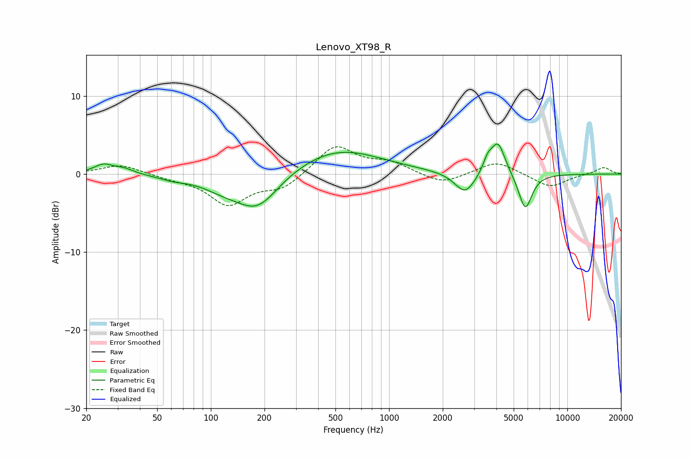

# Lenovo_XT98_R
See [usage instructions](https://github.com/jaakkopasanen/AutoEq#usage) for more options and info.

### Parametric EQs
Apply preamp of -3.9 dB when using parametric equalizer.

|   # | Type    |   Fc (Hz) |    Q |   Gain (dB) |
|-----|---------|-----------|------|-------------|
|   1 | Peaking |        25 | 2.56 |         1.2 |
|   2 | Peaking |        33 | 2.68 |         0.6 |
|   3 | Peaking |        61 | 2.06 |        -0.4 |
|   4 | Peaking |       118 | 1.13 |        -1.4 |
|   5 | Peaking |       183 | 1.17 |        -4.4 |
|   6 | Peaking |       516 | 0.58 |         3.3 |
|   7 | Peaking |      2670 | 2.45 |        -2.8 |
|   8 | Peaking |      3572 | 5.33 |         1.5 |
|   9 | Peaking |      4084 | 3.47 |         4.2 |
|  10 | Peaking |      5805 | 3.68 |        -4.7 |

### Fixed Band EQs
When using fixed band (also called graphic) equalizer, apply preamp of **-3.6 dB** (if available) and set gains manually with these parameters.

|   # | Type    |   Fc (Hz) |    Q |   Gain (dB) |
|-----|---------|-----------|------|-------------|
|   1 | Peaking |        31 | 1.41 |         1.2 |
|   2 | Peaking |        62 | 1.41 |        -0.4 |
|   3 | Peaking |       125 | 1.41 |        -3.8 |
|   4 | Peaking |       250 | 1.41 |        -1.8 |
|   5 | Peaking |       500 | 1.41 |         3.7 |
|   6 | Peaking |      1000 | 1.41 |         1.4 |
|   7 | Peaking |      2000 | 1.41 |        -1.4 |
|   8 | Peaking |      4000 | 1.41 |         1.7 |
|   9 | Peaking |      8000 | 1.41 |        -1.7 |
|  10 | Peaking |     16000 | 1.41 |         0.9 |

### Graphs

