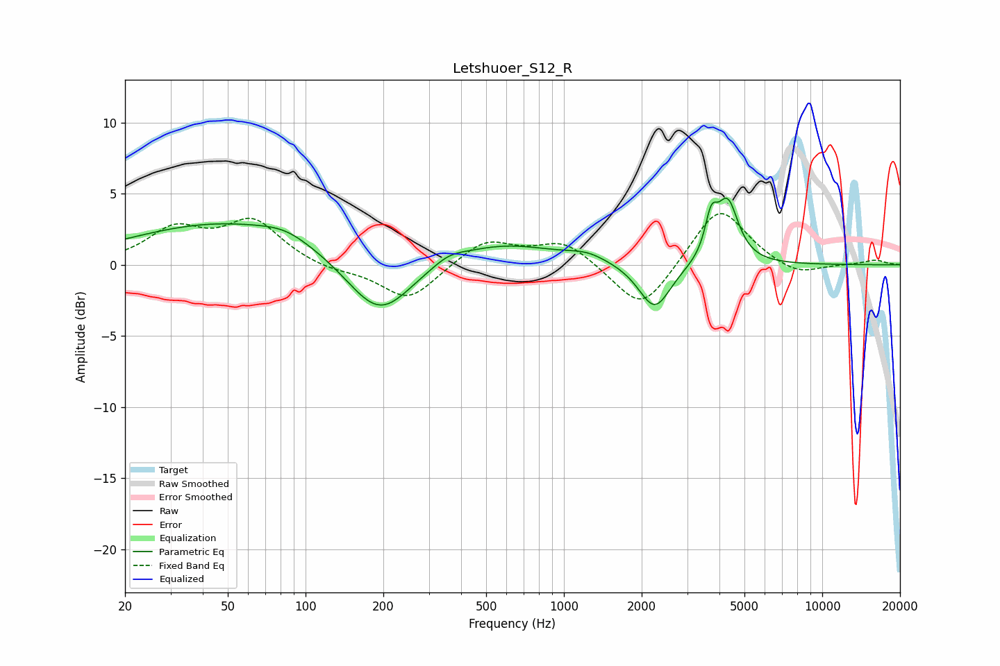

# Letshuoer_S12_R
See [usage instructions](https://github.com/jaakkopasanen/AutoEq#usage) for more options and info.

### Parametric EQs
Apply preamp of -4.8 dB when using parametric equalizer.

|   # | Type    |   Fc (Hz) |    Q |   Gain (dB) |
|-----|---------|-----------|------|-------------|
|   1 | Peaking |        50 | 0.38 |         3   |
|   2 | Peaking |        83 | 1.55 |         0.6 |
|   3 | Peaking |       190 | 1.09 |        -3.4 |
|   4 | Peaking |       200 | 1.3  |        -1   |
|   5 | Peaking |       358 | 2.34 |         0.5 |
|   6 | Peaking |       577 | 0.69 |         1.5 |
|   7 | Peaking |      1229 | 1.84 |         0.5 |
|   8 | Peaking |      2247 | 2.29 |        -3.3 |
|   9 | Peaking |      3716 | 6    |         2.5 |
|  10 | Peaking |      4301 | 3.35 |         4.3 |

### Fixed Band EQs
When using fixed band (also called graphic) equalizer, apply preamp of **-3.7 dB** (if available) and set gains manually with these parameters.

|   # | Type    |   Fc (Hz) |    Q |   Gain (dB) |
|-----|---------|-----------|------|-------------|
|   1 | Peaking |        31 | 1.41 |         2.3 |
|   2 | Peaking |        62 | 1.41 |         3   |
|   3 | Peaking |       125 | 1.41 |        -0.4 |
|   4 | Peaking |       250 | 1.41 |        -2.5 |
|   5 | Peaking |       500 | 1.41 |         1.8 |
|   6 | Peaking |      1000 | 1.41 |         1.7 |
|   7 | Peaking |      2000 | 1.41 |        -3.5 |
|   8 | Peaking |      4000 | 1.41 |         4.2 |
|   9 | Peaking |      8000 | 1.41 |        -0.8 |
|  10 | Peaking |     16000 | 1.41 |         0.3 |

### Graphs

