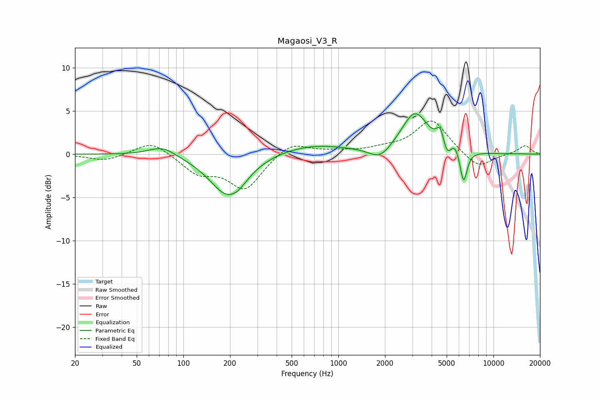

# Magaosi_V3_R
See [usage instructions](https://github.com/jaakkopasanen/AutoEq#usage) for more options and info.

### Parametric EQs
Apply preamp of -4.8 dB when using parametric equalizer.

|   # | Type    |   Fc (Hz) |    Q |   Gain (dB) |
|-----|---------|-----------|------|-------------|
|   1 | Peaking |        73 | 1.64 |         1.1 |
|   2 | Peaking |       193 | 1.21 |        -4.7 |
|   3 | Peaking |       230 | 2.34 |        -0.5 |
|   4 | Peaking |       672 | 0.61 |         1.1 |
|   5 | Peaking |      1859 | 2.05 |        -1.4 |
|   6 | Peaking |      3122 | 1.64 |         4.8 |
|   7 | Peaking |      4533 | 6    |         1.8 |
|   8 | Peaking |      5027 | 6    |        -1.2 |
|   9 | Peaking |      5679 | 5.99 |         0.8 |
|  10 | Peaking |      6431 | 6    |        -3.7 |

### Fixed Band EQs
When using fixed band (also called graphic) equalizer, apply preamp of **-3.9 dB** (if available) and set gains manually with these parameters.

|   # | Type    |   Fc (Hz) |    Q |   Gain (dB) |
|-----|---------|-----------|------|-------------|
|   1 | Peaking |        31 | 1.41 |        -0.8 |
|   2 | Peaking |        62 | 1.41 |         1.6 |
|   3 | Peaking |       125 | 1.41 |        -2.1 |
|   4 | Peaking |       250 | 1.41 |        -4   |
|   5 | Peaking |       500 | 1.41 |         1.5 |
|   6 | Peaking |      1000 | 1.41 |         0.3 |
|   7 | Peaking |      2000 | 1.41 |         0.5 |
|   8 | Peaking |      4000 | 1.41 |         4   |
|   9 | Peaking |      8000 | 1.41 |        -1.8 |
|  10 | Peaking |     16000 | 1.41 |         1   |

### Graphs

