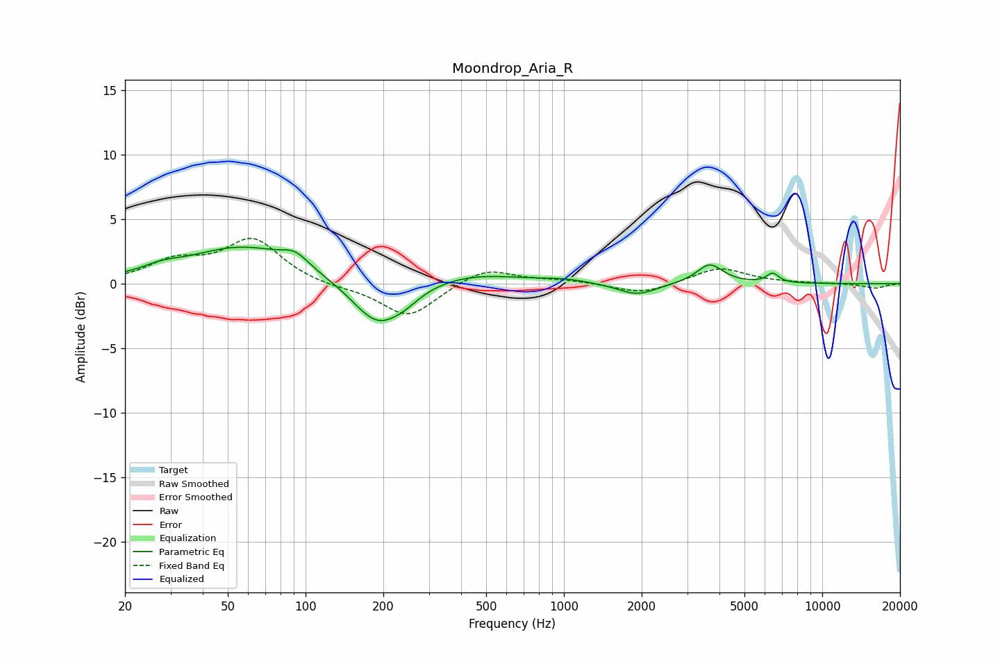

# Moondrop_Aria_R
See [usage instructions](https://github.com/jaakkopasanen/AutoEq#usage) for more options and info.

### Parametric EQs
Apply preamp of -2.9 dB when using parametric equalizer.

|   # | Type    |   Fc (Hz) |    Q |   Gain (dB) |
|-----|---------|-----------|------|-------------|
|   1 | Peaking |        28 | 1.99 |         0.5 |
|   2 | Peaking |        57 | 0.66 |         2.8 |
|   3 | Peaking |        91 | 2.75 |         1   |
|   4 | Peaking |       190 | 1.45 |        -3.4 |
|   5 | Peaking |       242 | 2.33 |        -0.6 |
|   6 | Peaking |       443 | 0.79 |         0.8 |
|   7 | Peaking |      1012 | 1.55 |         0.3 |
|   8 | Peaking |      1919 | 1.89 |        -0.9 |
|   9 | Peaking |      3670 | 2.77 |         1.5 |
|  10 | Peaking |      6428 | 5.82 |         0.7 |

### Fixed Band EQs
When using fixed band (also called graphic) equalizer, apply preamp of **-3.6 dB** (if available) and set gains manually with these parameters.

|   # | Type    |   Fc (Hz) |    Q |   Gain (dB) |
|-----|---------|-----------|------|-------------|
|   1 | Peaking |        31 | 1.41 |         1.6 |
|   2 | Peaking |        62 | 1.41 |         3.3 |
|   3 | Peaking |       125 | 1.41 |        -0.3 |
|   4 | Peaking |       250 | 1.41 |        -2.6 |
|   5 | Peaking |       500 | 1.41 |         1.3 |
|   6 | Peaking |      1000 | 1.41 |         0.3 |
|   7 | Peaking |      2000 | 1.41 |        -0.8 |
|   8 | Peaking |      4000 | 1.41 |         1.3 |
|   9 | Peaking |      8000 | 1.41 |         0   |
|  10 | Peaking |     16000 | 1.41 |        -0.4 |

### Graphs

