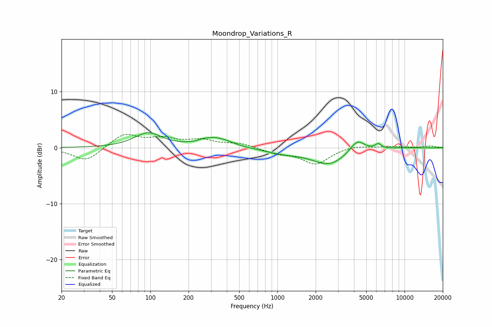

# Moondrop_Variations_R
See [usage instructions](https://github.com/jaakkopasanen/AutoEq#usage) for more options and info.

### Parametric EQs
Apply preamp of -2.8 dB when using parametric equalizer.

|   # | Type    |   Fc (Hz) |    Q |   Gain (dB) |
|-----|---------|-----------|------|-------------|
|   1 | Peaking |        96 | 1.32 |         2.6 |
|   2 | Peaking |       244 | 3.52 |        -0.2 |
|   3 | Peaking |       250 | 5.46 |         0.2 |
|   4 | Peaking |       309 | 1.35 |         1.7 |
|   5 | Peaking |       404 | 2.28 |         0.3 |
|   6 | Peaking |      1090 | 1.05 |        -0.8 |
|   7 | Peaking |      2547 | 1.03 |        -2.9 |
|   8 | Peaking |      4240 | 2.49 |         2.2 |
|   9 | Peaking |      6211 | 5.8  |         0.9 |
|  10 | Peaking |      9007 | 2.1  |         0.1 |

### Fixed Band EQs
When using fixed band (also called graphic) equalizer, apply preamp of **-2.5 dB** (if available) and set gains manually with these parameters.

|   # | Type    |   Fc (Hz) |    Q |   Gain (dB) |
|-----|---------|-----------|------|-------------|
|   1 | Peaking |        31 | 1.41 |        -2.5 |
|   2 | Peaking |        62 | 1.41 |         2.5 |
|   3 | Peaking |       125 | 1.41 |         1.4 |
|   4 | Peaking |       250 | 1.41 |         1.2 |
|   5 | Peaking |       500 | 1.41 |         0.8 |
|   6 | Peaking |      1000 | 1.41 |        -0.9 |
|   7 | Peaking |      2000 | 1.41 |        -2.9 |
|   8 | Peaking |      4000 | 1.41 |         0.5 |
|   9 | Peaking |      8000 | 1.41 |         0.2 |
|  10 | Peaking |     16000 | 1.41 |         0.3 |

### Graphs

