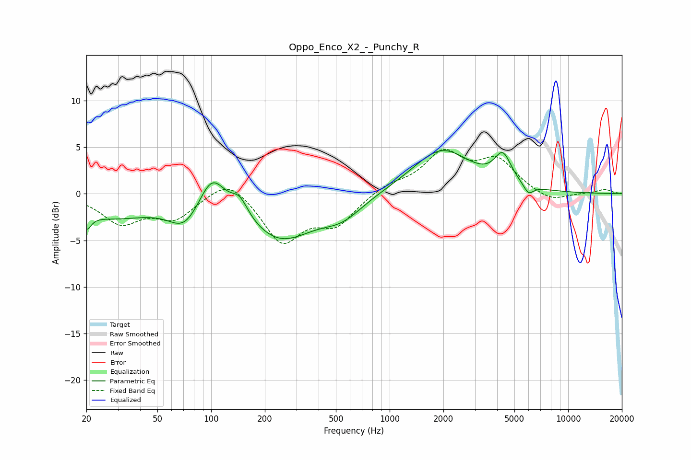

# Oppo_Enco_X2_-_Punchy_R
See [usage instructions](https://github.com/jaakkopasanen/AutoEq#usage) for more options and info.

### Parametric EQs
Apply preamp of -4.7 dB when using parametric equalizer.

|   # | Type    |   Fc (Hz) |    Q |   Gain (dB) |
|-----|---------|-----------|------|-------------|
|   1 | Peaking |        20 | 5.57 |        -1.6 |
|   2 | Peaking |        28 | 0.59 |        -2.4 |
|   3 | Peaking |        71 | 1.65 |        -2.7 |
|   4 | Peaking |       101 | 1.94 |         3.9 |
|   5 | Peaking |       145 | 2.99 |         1.9 |
|   6 | Peaking |       243 | 0.75 |        -4.8 |
|   7 | Peaking |       543 | 1.22 |        -1.9 |
|   8 | Peaking |      1957 | 0.86 |         4.7 |
|   9 | Peaking |      4306 | 2.96 |         3.1 |
|  10 | Peaking |      5993 | 4.97 |        -1.1 |

### Fixed Band EQs
When using fixed band (also called graphic) equalizer, apply preamp of **-4.9 dB** (if available) and set gains manually with these parameters.

|   # | Type    |   Fc (Hz) |    Q |   Gain (dB) |
|-----|---------|-----------|------|-------------|
|   1 | Peaking |        31 | 1.41 |        -3   |
|   2 | Peaking |        62 | 1.41 |        -2.5 |
|   3 | Peaking |       125 | 1.41 |         2.1 |
|   4 | Peaking |       250 | 1.41 |        -5.1 |
|   5 | Peaking |       500 | 1.41 |        -3.1 |
|   6 | Peaking |      1000 | 1.41 |         0.9 |
|   7 | Peaking |      2000 | 1.41 |         4.2 |
|   8 | Peaking |      4000 | 1.41 |         3.3 |
|   9 | Peaking |      8000 | 1.41 |        -1   |
|  10 | Peaking |     16000 | 1.41 |         0.5 |

### Graphs

