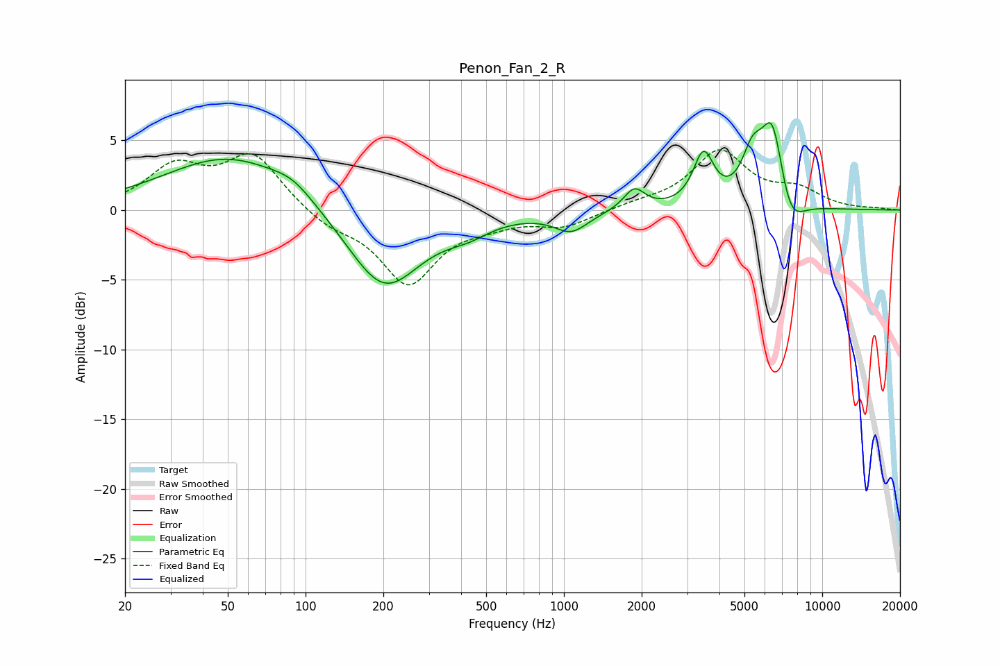

# Penon_Fan_2_R
See [usage instructions](https://github.com/jaakkopasanen/AutoEq#usage) for more options and info.

### Parametric EQs
Apply preamp of -6.4 dB when using parametric equalizer.

|   # | Type    |   Fc (Hz) |    Q |   Gain (dB) |
|-----|---------|-----------|------|-------------|
|   1 | Peaking |        51 | 0.56 |         3.9 |
|   2 | Peaking |        90 | 1.76 |         0.9 |
|   3 | Peaking |       201 | 0.99 |        -5.9 |
|   4 | Peaking |       425 | 1.62 |        -0.8 |
|   5 | Peaking |      1068 | 2.16 |        -1.4 |
|   6 | Peaking |      1873 | 3.47 |         1.5 |
|   7 | Peaking |      3472 | 3.59 |         3.7 |
|   8 | Peaking |      5370 | 3.32 |         3.1 |
|   9 | Peaking |      6421 | 3.02 |         6.2 |
|  10 | Peaking |      7470 | 2.6  |        -2.6 |

### Fixed Band EQs
When using fixed band (also called graphic) equalizer, apply preamp of **-4.4 dB** (if available) and set gains manually with these parameters.

|   # | Type    |   Fc (Hz) |    Q |   Gain (dB) |
|-----|---------|-----------|------|-------------|
|   1 | Peaking |        31 | 1.41 |         2.9 |
|   2 | Peaking |        62 | 1.41 |         3.8 |
|   3 | Peaking |       125 | 1.41 |        -1.1 |
|   4 | Peaking |       250 | 1.41 |        -5.2 |
|   5 | Peaking |       500 | 1.41 |        -0.7 |
|   6 | Peaking |      1000 | 1.41 |        -1.1 |
|   7 | Peaking |      2000 | 1.41 |         0.4 |
|   8 | Peaking |      4000 | 1.41 |         4.1 |
|   9 | Peaking |      8000 | 1.41 |         1.3 |
|  10 | Peaking |     16000 | 1.41 |         0.1 |

### Graphs

