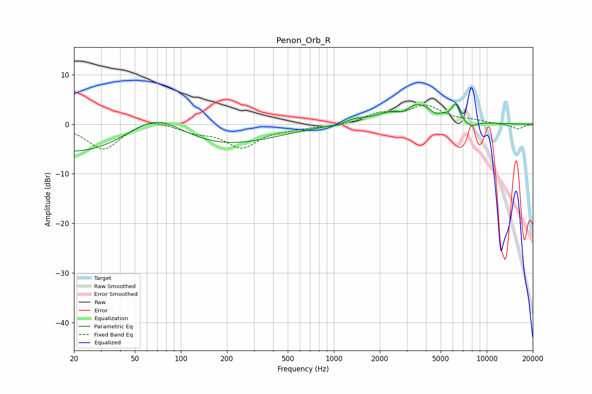

# Penon_Orb_R
See [usage instructions](https://github.com/jaakkopasanen/AutoEq#usage) for more options and info.

### Parametric EQs
Apply preamp of -4.2 dB when using parametric equalizer.

|   # | Type    |   Fc (Hz) |    Q |   Gain (dB) |
|-----|---------|-----------|------|-------------|
|   1 | Peaking |        55 | 0.18 |        -9.5 |
|   2 | Peaking |        68 | 0.59 |         9.8 |
|   3 | Peaking |      1147 | 1.42 |         0.4 |
|   4 | Peaking |      1191 | 1.88 |        -1.5 |
|   5 | Peaking |      1281 | 2.13 |         1.5 |
|   6 | Peaking |      2859 | 2.96 |        -1.9 |
|   7 | Peaking |      3234 | 0.97 |         4.9 |
|   8 | Peaking |      4581 | 4.47 |        -0.8 |
|   9 | Peaking |      6261 | 5.8  |         3   |
|  10 | Peaking |      7861 | 3.12 |        -1.3 |

### Fixed Band EQs
When using fixed band (also called graphic) equalizer, apply preamp of **-4.0 dB** (if available) and set gains manually with these parameters.

|   # | Type    |   Fc (Hz) |    Q |   Gain (dB) |
|-----|---------|-----------|------|-------------|
|   1 | Peaking |        31 | 1.41 |        -5.2 |
|   2 | Peaking |        62 | 1.41 |         1.5 |
|   3 | Peaking |       125 | 1.41 |        -1.3 |
|   4 | Peaking |       250 | 1.41 |        -4.5 |
|   5 | Peaking |       500 | 1.41 |        -0.7 |
|   6 | Peaking |      1000 | 1.41 |        -0.5 |
|   7 | Peaking |      2000 | 1.41 |         2   |
|   8 | Peaking |      4000 | 1.41 |         3.5 |
|   9 | Peaking |      8000 | 1.41 |         0.6 |
|  10 | Peaking |     16000 | 1.41 |        -1   |

### Graphs

