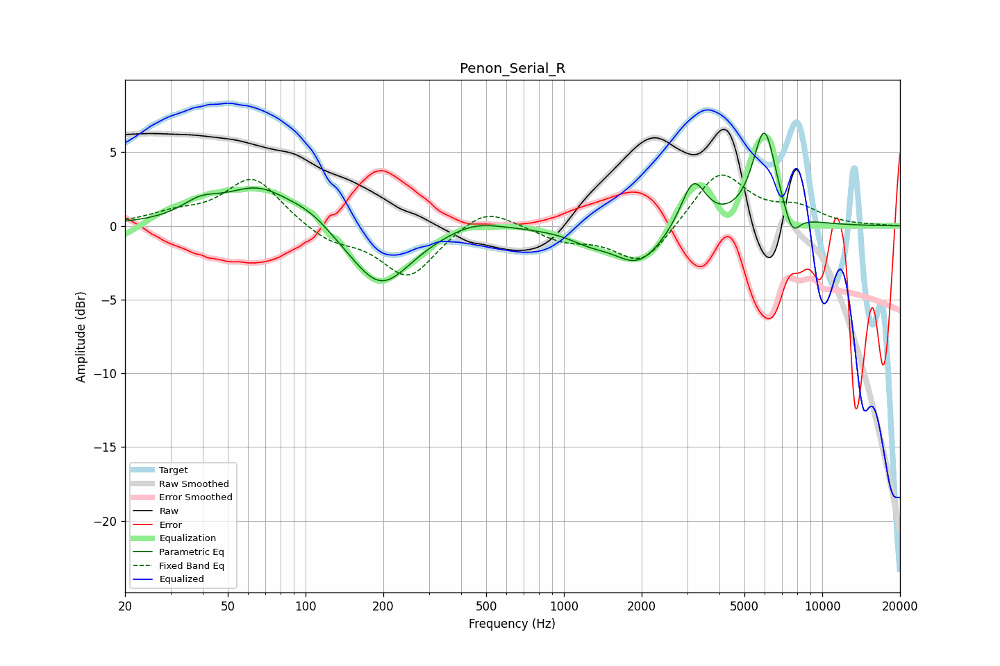

# Penon_Serial_R
See [usage instructions](https://github.com/jaakkopasanen/AutoEq#usage) for more options and info.

### Parametric EQs
Apply preamp of -6.4 dB when using parametric equalizer.

|   # | Type    |   Fc (Hz) |    Q |   Gain (dB) |
|-----|---------|-----------|------|-------------|
|   1 | Peaking |        39 | 1.93 |         1   |
|   2 | Peaking |        66 | 1.07 |         2.5 |
|   3 | Peaking |       104 | 1.67 |         0.8 |
|   4 | Peaking |       195 | 1.19 |        -4.2 |
|   5 | Peaking |       449 | 1.36 |         0.7 |
|   6 | Peaking |      1247 | 1.85 |        -0.6 |
|   7 | Peaking |      1940 | 1.42 |        -2.6 |
|   8 | Peaking |      3168 | 2.9  |         3.3 |
|   9 | Peaking |      5974 | 2.96 |         6.5 |
|  10 | Peaking |      7640 | 4.23 |        -1.7 |

### Fixed Band EQs
When using fixed band (also called graphic) equalizer, apply preamp of **-3.5 dB** (if available) and set gains manually with these parameters.

|   # | Type    |   Fc (Hz) |    Q |   Gain (dB) |
|-----|---------|-----------|------|-------------|
|   1 | Peaking |        31 | 1.41 |         0.7 |
|   2 | Peaking |        62 | 1.41 |         3.3 |
|   3 | Peaking |       125 | 1.41 |        -1   |
|   4 | Peaking |       250 | 1.41 |        -3.5 |
|   5 | Peaking |       500 | 1.41 |         1.5 |
|   6 | Peaking |      1000 | 1.41 |        -0.9 |
|   7 | Peaking |      2000 | 1.41 |        -2.7 |
|   8 | Peaking |      4000 | 1.41 |         3.8 |
|   9 | Peaking |      8000 | 1.41 |         1.1 |
|  10 | Peaking |     16000 | 1.41 |         0   |

### Graphs

