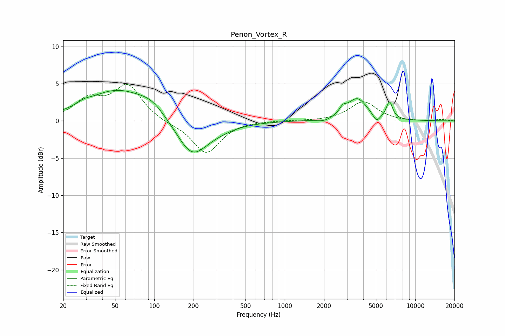

# Penon_Vortex_R
See [usage instructions](https://github.com/jaakkopasanen/AutoEq#usage) for more options and info.

### Parametric EQs
Apply preamp of -4.2 dB when using parametric equalizer.

|   # | Type    |   Fc (Hz) |    Q |   Gain (dB) |
|-----|---------|-----------|------|-------------|
|   1 | Peaking |        29 | 2.96 |         0.4 |
|   2 | Peaking |        52 | 0.61 |         4   |
|   3 | Peaking |        95 | 1.39 |         1.4 |
|   4 | Peaking |       194 | 1.2  |        -4.8 |
|   5 | Peaking |       305 | 1.02 |        -0.6 |
|   6 | Peaking |      1986 | 2.73 |        -0.4 |
|   7 | Peaking |      2789 | 5.28 |         0.8 |
|   8 | Peaking |      3593 | 1.87 |         3   |
|   9 | Peaking |      5052 | 5.06 |        -1.1 |
|  10 | Peaking |      6350 | 5.68 |         2.3 |

### Fixed Band EQs
When using fixed band (also called graphic) equalizer, apply preamp of **-5.0 dB** (if available) and set gains manually with these parameters.

|   # | Type    |   Fc (Hz) |    Q |   Gain (dB) |
|-----|---------|-----------|------|-------------|
|   1 | Peaking |        31 | 1.41 |         2.6 |
|   2 | Peaking |        62 | 1.41 |         4.6 |
|   3 | Peaking |       125 | 1.41 |        -0.3 |
|   4 | Peaking |       250 | 1.41 |        -4.4 |
|   5 | Peaking |       500 | 1.41 |         0.1 |
|   6 | Peaking |      1000 | 1.41 |         0.1 |
|   7 | Peaking |      2000 | 1.41 |        -0   |
|   8 | Peaking |      4000 | 1.41 |         2.6 |
|   9 | Peaking |      8000 | 1.41 |        -0.1 |
|  10 | Peaking |     16000 | 1.41 |         0.2 |

### Graphs

