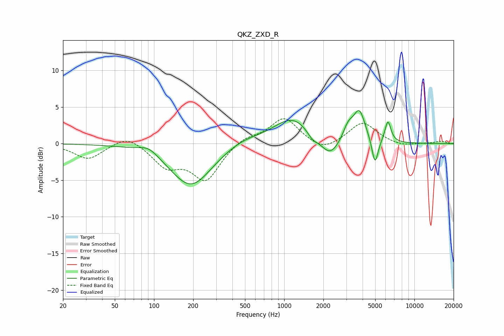

# QKZ_ZXD_R
See [usage instructions](https://github.com/jaakkopasanen/AutoEq#usage) for more options and info.

### Parametric EQs
Apply preamp of -4.6 dB when using parametric equalizer.

|   # | Type    |   Fc (Hz) |    Q |   Gain (dB) |
|-----|---------|-----------|------|-------------|
|   1 | Peaking |        91 | 1.87 |         1.1 |
|   2 | Peaking |       192 | 0.88 |        -5.9 |
|   3 | Peaking |       479 | 0.94 |         1   |
|   4 | Peaking |      1164 | 0.98 |         3.5 |
|   5 | Peaking |      1646 | 3.43 |        -0.9 |
|   6 | Peaking |      2245 | 1.95 |        -2.6 |
|   7 | Peaking |      3101 | 3.49 |         2   |
|   8 | Peaking |      3781 | 3.09 |         4.2 |
|   9 | Peaking |      4983 | 5.84 |        -3.7 |
|  10 | Peaking |      6258 | 5.92 |         2.9 |

### Fixed Band EQs
When using fixed band (also called graphic) equalizer, apply preamp of **-3.5 dB** (if available) and set gains manually with these parameters.

|   # | Type    |   Fc (Hz) |    Q |   Gain (dB) |
|-----|---------|-----------|------|-------------|
|   1 | Peaking |        31 | 1.41 |        -2.1 |
|   2 | Peaking |        62 | 1.41 |         1.4 |
|   3 | Peaking |       125 | 1.41 |        -2.9 |
|   4 | Peaking |       250 | 1.41 |        -4.8 |
|   5 | Peaking |       500 | 1.41 |         1   |
|   6 | Peaking |      1000 | 1.41 |         3.5 |
|   7 | Peaking |      2000 | 1.41 |        -1.3 |
|   8 | Peaking |      4000 | 1.41 |         2.9 |
|   9 | Peaking |      8000 | 1.41 |        -0.4 |
|  10 | Peaking |     16000 | 1.41 |         0.3 |

### Graphs

