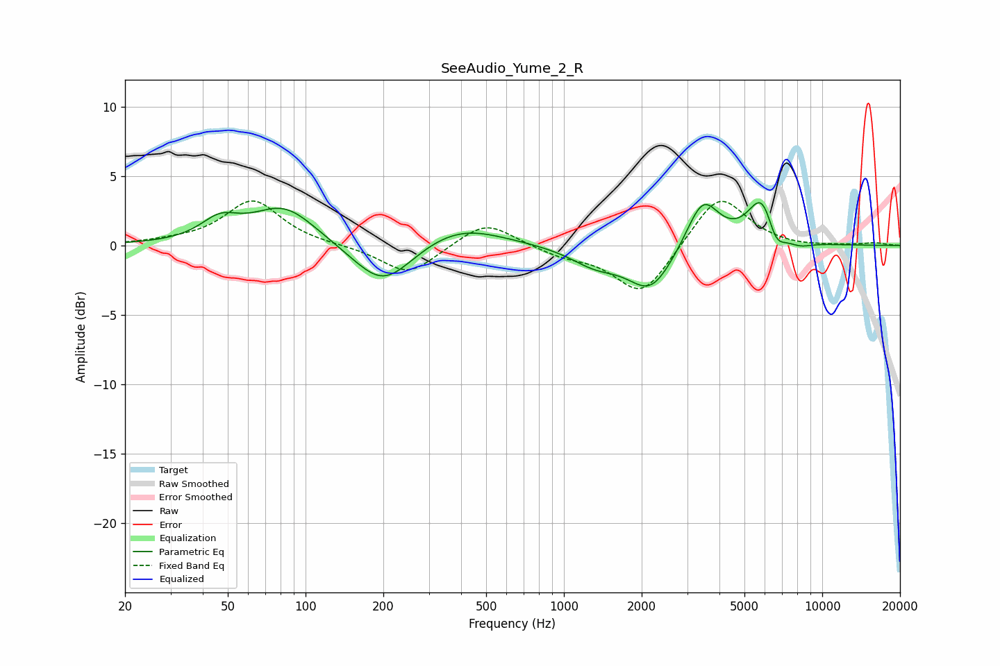

# SeeAudio_Yume_2_R
See [usage instructions](https://github.com/jaakkopasanen/AutoEq#usage) for more options and info.

### Parametric EQs
Apply preamp of -3.2 dB when using parametric equalizer.

|   # | Type    |   Fc (Hz) |    Q |   Gain (dB) |
|-----|---------|-----------|------|-------------|
|   1 | Peaking |        47 | 1.94 |         1.5 |
|   2 | Peaking |        83 | 1.14 |         2.8 |
|   3 | Peaking |       199 | 1.23 |        -3.2 |
|   4 | Peaking |       392 | 0.86 |         1.6 |
|   5 | Peaking |      1323 | 1.46 |        -1.2 |
|   6 | Peaking |      2169 | 1.6  |        -3.2 |
|   7 | Peaking |      3448 | 2.23 |         3.6 |
|   8 | Peaking |      5902 | 2.47 |         3.9 |
|   9 | Peaking |      6574 | 3.58 |        -2.1 |
|  10 | Peaking |      8155 | 2.63 |        -0.4 |

### Fixed Band EQs
When using fixed band (also called graphic) equalizer, apply preamp of **-3.3 dB** (if available) and set gains manually with these parameters.

|   # | Type    |   Fc (Hz) |    Q |   Gain (dB) |
|-----|---------|-----------|------|-------------|
|   1 | Peaking |        31 | 1.41 |         0.2 |
|   2 | Peaking |        62 | 1.41 |         3.2 |
|   3 | Peaking |       125 | 1.41 |        -0   |
|   4 | Peaking |       250 | 1.41 |        -2.1 |
|   5 | Peaking |       500 | 1.41 |         1.8 |
|   6 | Peaking |      1000 | 1.41 |        -0.6 |
|   7 | Peaking |      2000 | 1.41 |        -3.7 |
|   8 | Peaking |      4000 | 1.41 |         3.8 |
|   9 | Peaking |      8000 | 1.41 |        -0.1 |
|  10 | Peaking |     16000 | 1.41 |         0.2 |

### Graphs

