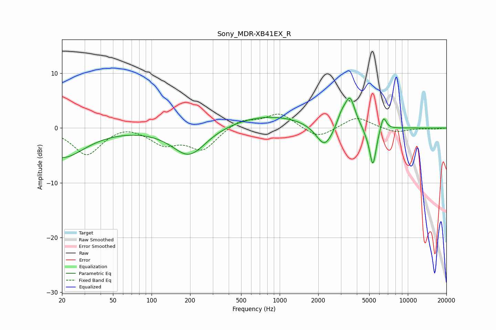

# Sony_MDR-XB41EX_R
See [usage instructions](https://github.com/jaakkopasanen/AutoEq#usage) for more options and info.

### Parametric EQs
Apply preamp of -5.6 dB when using parametric equalizer.

|   # | Type    |   Fc (Hz) |    Q |   Gain (dB) |
|-----|---------|-----------|------|-------------|
|   1 | Peaking |        20 | 0.81 |        -5.4 |
|   2 | Peaking |       197 | 1.08 |        -5.3 |
|   3 | Peaking |       804 | 0.45 |         2.4 |
|   4 | Peaking |      2241 | 2.15 |        -4.3 |
|   5 | Peaking |      3020 | 4.39 |         1.5 |
|   6 | Peaking |      3280 | 2.75 |         1   |
|   7 | Peaking |      3548 | 3.62 |         4.8 |
|   8 | Peaking |      4713 | 5.53 |        -0.5 |
|   9 | Peaking |      5336 | 5.19 |        -7.2 |
|  10 | Peaking |      6445 | 5.96 |         2.7 |

### Fixed Band EQs
When using fixed band (also called graphic) equalizer, apply preamp of **-2.6 dB** (if available) and set gains manually with these parameters.

|   # | Type    |   Fc (Hz) |    Q |   Gain (dB) |
|-----|---------|-----------|------|-------------|
|   1 | Peaking |        31 | 1.41 |        -4.9 |
|   2 | Peaking |        62 | 1.41 |         0.8 |
|   3 | Peaking |       125 | 1.41 |        -2.7 |
|   4 | Peaking |       250 | 1.41 |        -3.9 |
|   5 | Peaking |       500 | 1.41 |         1.6 |
|   6 | Peaking |      1000 | 1.41 |         2.7 |
|   7 | Peaking |      2000 | 1.41 |        -2   |
|   8 | Peaking |      4000 | 1.41 |         2.1 |
|   9 | Peaking |      8000 | 1.41 |        -0.9 |
|  10 | Peaking |     16000 | 1.41 |        -0.2 |

### Graphs

