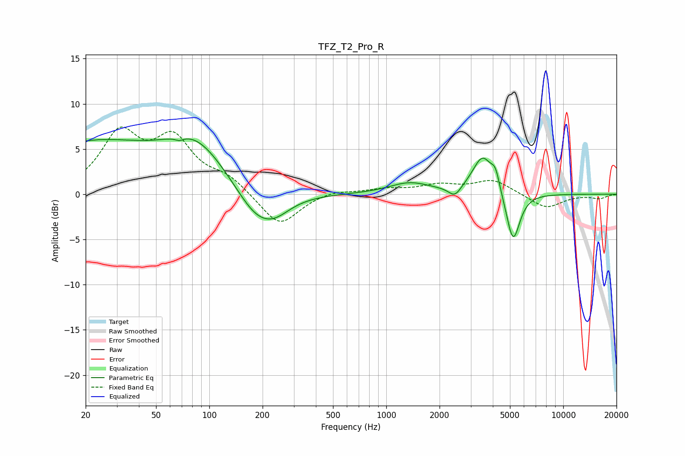

# TFZ_T2_Pro_R
See [usage instructions](https://github.com/jaakkopasanen/AutoEq#usage) for more options and info.

### Parametric EQs
Apply preamp of -6.2 dB when using parametric equalizer.

|   # | Type    |   Fc (Hz) |    Q |   Gain (dB) |
|-----|---------|-----------|------|-------------|
|   1 | Peaking |        21 | 0.38 |         5.5 |
|   2 | Peaking |        68 | 6    |        -0.4 |
|   3 | Peaking |        84 | 0.81 |         4.8 |
|   4 | Peaking |       186 | 1.17 |        -3.5 |
|   5 | Peaking |       237 | 1.59 |        -1.3 |
|   6 | Peaking |      1355 | 1.21 |         1.2 |
|   7 | Peaking |      2440 | 4.07 |        -1.2 |
|   8 | Peaking |      3505 | 2.45 |         4.2 |
|   9 | Peaking |      4139 | 5.96 |         1.8 |
|  10 | Peaking |      5206 | 3.62 |        -5.7 |

### Fixed Band EQs
When using fixed band (also called graphic) equalizer, apply preamp of **-7.5 dB** (if available) and set gains manually with these parameters.

|   # | Type    |   Fc (Hz) |    Q |   Gain (dB) |
|-----|---------|-----------|------|-------------|
|   1 | Peaking |        31 | 1.41 |         6.3 |
|   2 | Peaking |        62 | 1.41 |         5.5 |
|   3 | Peaking |       125 | 1.41 |         1.6 |
|   4 | Peaking |       250 | 1.41 |        -3.6 |
|   5 | Peaking |       500 | 1.41 |         0.5 |
|   6 | Peaking |      1000 | 1.41 |         0.5 |
|   7 | Peaking |      2000 | 1.41 |         0.9 |
|   8 | Peaking |      4000 | 1.41 |         1.6 |
|   9 | Peaking |      8000 | 1.41 |        -1.6 |
|  10 | Peaking |     16000 | 1.41 |        -0.4 |

### Graphs

