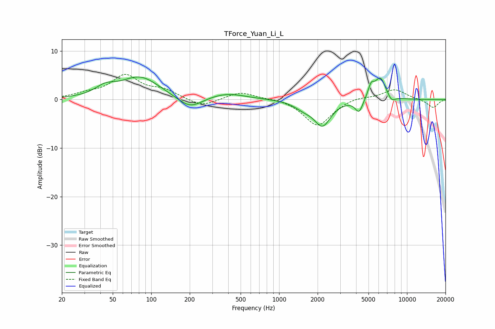

# TForce_Yuan_Li_L
See [usage instructions](https://github.com/jaakkopasanen/AutoEq#usage) for more options and info.

### Parametric EQs
Apply preamp of -4.7 dB when using parametric equalizer.

|   # | Type    |   Fc (Hz) |    Q |   Gain (dB) |
|-----|---------|-----------|------|-------------|
|   1 | Peaking |        44 | 1.82 |         1.7 |
|   2 | Peaking |        82 | 0.92 |         4.6 |
|   3 | Peaking |       201 | 1.45 |        -2.6 |
|   4 | Peaking |       386 | 0.98 |         1.3 |
|   5 | Peaking |      1548 | 2.04 |        -1.3 |
|   6 | Peaking |      2181 | 2.18 |        -5.2 |
|   7 | Peaking |      4216 | 4.76 |        -2.7 |
|   8 | Peaking |      5236 | 5.97 |         2.3 |
|   9 | Peaking |      6179 | 3.05 |         4.6 |
|  10 | Peaking |      7560 | 4.59 |        -1.3 |

### Fixed Band EQs
When using fixed band (also called graphic) equalizer, apply preamp of **-5.3 dB** (if available) and set gains manually with these parameters.

|   # | Type    |   Fc (Hz) |    Q |   Gain (dB) |
|-----|---------|-----------|------|-------------|
|   1 | Peaking |        31 | 1.41 |         0.9 |
|   2 | Peaking |        62 | 1.41 |         4.8 |
|   3 | Peaking |       125 | 1.41 |         1.7 |
|   4 | Peaking |       250 | 1.41 |        -1.6 |
|   5 | Peaking |       500 | 1.41 |         1.6 |
|   6 | Peaking |      1000 | 1.41 |         0.3 |
|   7 | Peaking |      2000 | 1.41 |        -5.5 |
|   8 | Peaking |      4000 | 1.41 |         0.7 |
|   9 | Peaking |      8000 | 1.41 |         2.1 |
|  10 | Peaking |     16000 | 1.41 |        -1.7 |

### Graphs

